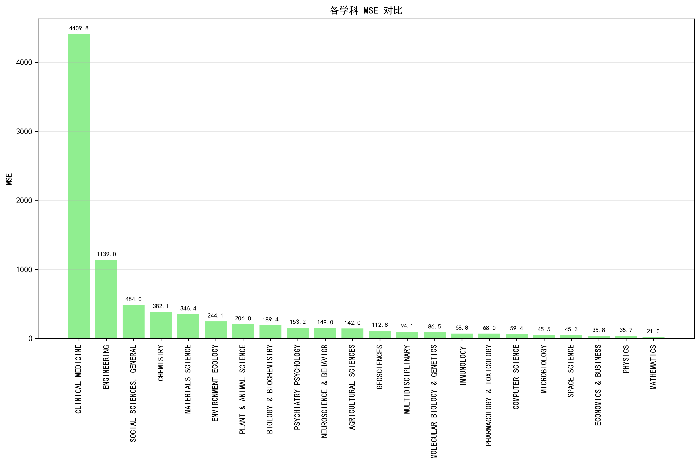
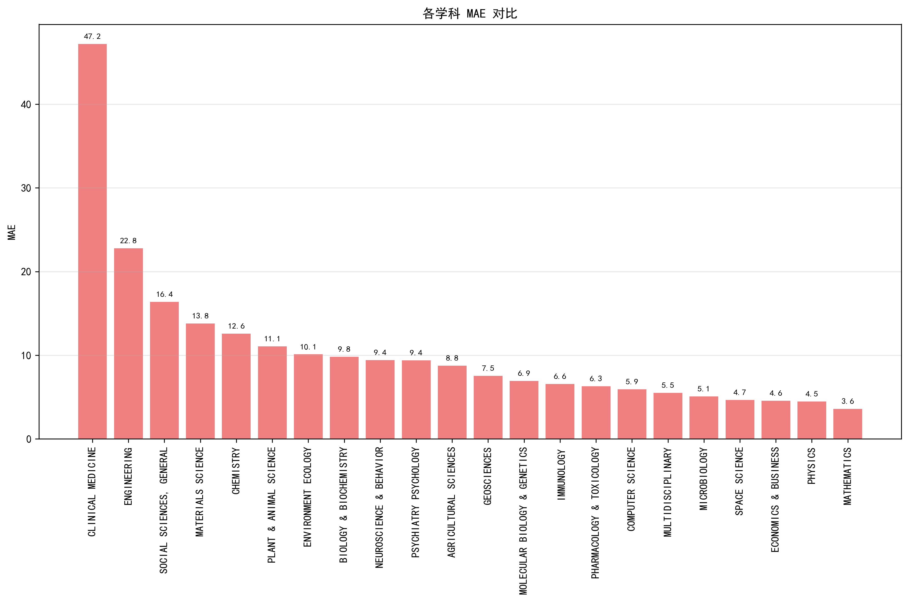
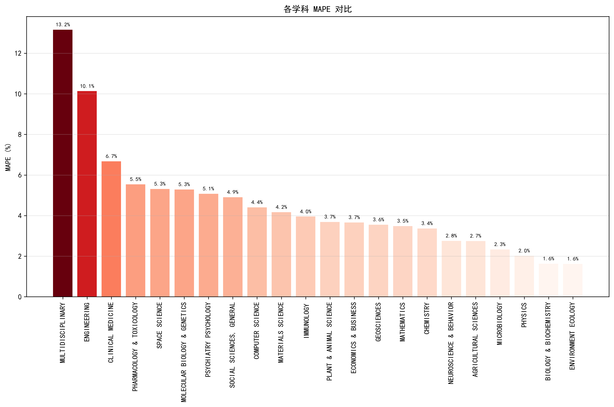
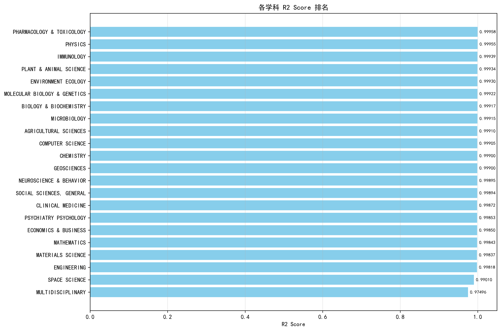

# 第七次作业实验文档

## 基于表格深度学习（TabNet）的学科排名预测模型

### 任务描述

在上一节课作业的基础上，利用表格深度学习方法，对各学科做一个改进版的排名模型。

### 实现过程（[TabularDeepLearning.py](./TabularDeepLearning.py)）

#### 1. 数据预处理与特征工程

首先，程序加载并预处理指定学科的数据，进行数据预处理和特征工程处理。

```python
def load_and_preprocess_data(subject_name):
    """
    加载并预处理指定学科的数据
    """
    file_path = os.path.join("download", f"{subject_name}.csv")
    if not os.path.exists(file_path):
        print(f"文件 {file_path} 不存在")
        return None

    # 尝试不同的编码格式读取数据
    try:
        # 首先尝试UTF-8编码
        df = pd.read_csv(file_path, skiprows=1, encoding="utf-8")
    except UnicodeDecodeError:
        try:
            # 如果UTF-8失败，尝试ISO-8859-1编码
            df = pd.read_csv(file_path, skiprows=1, encoding="ISO-8859-1")
        except UnicodeDecodeError:
            # 如果都失败，让pandas自动检测编码
            df = pd.read_csv(file_path, skiprows=1, encoding="utf-8-sig")

    # 清理列名
    df.columns = ["Rank", "Institution", "Country", "Documents", "Cites", "CitesPerPaper", "TopPapers"]

    # 清理数据
    df = df.dropna()

    # 将排名转换为数值型
    df["Rank"] = pd.to_numeric(df["Rank"], errors="coerce")

    # 处理数值列，确保正确转换
    df["Documents"] = pd.to_numeric(df["Documents"].astype(str).str.replace(",", ""), errors="coerce")
    df["Cites"] = pd.to_numeric(df["Cites"].astype(str).str.replace(",", ""), errors="coerce")
    df["CitesPerPaper"] = pd.to_numeric(df["CitesPerPaper"], errors="coerce")
    df["TopPapers"] = pd.to_numeric(df["TopPapers"].astype(str).str.replace(",", ""), errors="coerce")

    # 删除空值
    df = df.dropna()

    return df
```

接着，创建扩展特征以增强模型的预测能力：

```python
def create_extended_features(df):
    """
    创建扩展特征
    """
    # 创建衍生特征
    df = df.copy()
    df["CitesPerDocument"] = df["Cites"] / (df["Documents"] + 1e-8)  # 避免除零
    df["TopPapersRatio"] = df["TopPapers"] / (df["Documents"] + 1e-8)
    df["LogDocuments"] = np.log(df["Documents"] + 1)
    df["LogCites"] = np.log(df["Cites"] + 1)
    df["LogTopPapers"] = np.log(df["TopPapers"] + 1)

    return df
```

#### 2. TabNet 模型构建

TabNet 是一种专门用于处理表格数据的深度学习架构，它通过注意力机制和特征选择来提高模型性能。

```python
class TabNetLayer(layers.Layer):
    """
    TabNet层的实现
    """
    def __init__(self, feature_dim=32, decision_dim=8, relaxation_factor=1.5, sparsity_coefficient=1e-5, **kwargs):
        super(TabNetLayer, self).__init__(**kwargs)
        self.feature_dim = feature_dim
        self.decision_dim = decision_dim
        self.relaxation_factor = relaxation_factor
        self.sparsity_coefficient = sparsity_coefficient

    def build(self, input_shape):
        self.bn = layers.BatchNormalization()
        self.fc = layers.Dense(self.feature_dim, activation='relu')
        self.attention_transformer = layers.Dense(input_shape[-1], activation='softmax')
        self.feature_transformer = layers.Dense(self.feature_dim, activation='relu')
        super(TabNetLayer, self).build(input_shape)

    def call(self, inputs, training=None):
        x = self.bn(inputs)
        x = self.fc(x)

        # 注意力机制
        attention = self.attention_transformer(x)
        masked_x = inputs * attention
        features = self.feature_transformer(masked_x)

        # 稀疏性损失
        self.add_loss(self.sparsity_coefficient * tf.reduce_mean(tf.reduce_sum(attention, axis=1)))

        return features, attention

def create_tabnet_model(input_dim, n_steps=3):
    """
    创建TabNet模型
    """
    inputs = layers.Input(shape=(input_dim,))

    # 初始化
    x = inputs
    output_layers = []
    total_attention = 0

    # 多步骤处理
    for step in range(n_steps):
        tabnet_layer = TabNetLayer(feature_dim=64, decision_dim=32)
        features, attention = tabnet_layer(x)
        output_layers.append(features)
        total_attention += attention

        # 更新输入用于下一步（放松机制）
        if step < n_steps - 1:
            x = inputs * (1 - attention * 0.5)  # 松弛因子

    # 合并所有步骤的输出
    if len(output_layers) > 1:
        x = layers.Concatenate()(output_layers)
    else:
        x = output_layers[0]

    # 最终预测层
    x = layers.Dense(64, activation='relu')(x)
    x = layers.Dropout(0.3)(x)
    x = layers.Dense(32, activation='relu')(x)
    x = layers.Dropout(0.2)(x)
    outputs = layers.Dense(1)(x)

    model = keras.Model(inputs=inputs, outputs=outputs)
    model.compile(
        optimizer=keras.optimizers.Adam(learning_rate=0.001),
        loss='mse',
        metrics=['mae']
    )

    return model
```

TabNet 模型的关键特性包括：

1. **注意力机制**：通过注意力变压器选择相关特征
2. **多步骤处理**：逐步关注不同的特征子集
3. **稀疏性约束**：鼓励模型关注最重要的特征
4. **可解释性**：可以可视化模型关注的特征

#### 3. 模型训练与评估

模型采用了早停和学习率自适应调整等优化策略以防止过拟合：

```python
# 训练模型 - 针对小数据集调整参数
early_stopping = keras.callbacks.EarlyStopping(monitor="val_loss", patience=25, restore_best_weights=True)
reduce_lr = keras.callbacks.ReduceLROnPlateau(monitor="val_loss", factor=0.5, patience=10, min_lr=0.0001)

# 确保在指定GPU上进行训练
with tf.device("/GPU:0"):  # 在我们设置的可见GPU上训练
    history = model.fit(
        X_train_scaled,
        y_train,
        validation_data=(X_val_scaled, y_val),
        epochs=150,  # 增加训练轮数，配合早停机制
        batch_size=min(16, len(X_train_scaled) // 4),  # 动态调整批次大小
        callbacks=[early_stopping, reduce_lr],
        verbose=1,
    )
```

使用多种评估指标（MSE、MAE、MAPE、R2）来评估模型性能：

```python
# 计算测试集评估指标
test_mse = mean_squared_error(y_test, y_test_pred)
test_mae = mean_absolute_error(y_test, y_test_pred)
test_mape = mean_absolute_percentage_error(y_test, y_test_pred)
test_r2 = r2_score(y_test, y_test_pred)

print(f"测试集 MSE: {test_mse:.2f}")
print(f"测试集 MAE: {test_mae:.2f}")
print(f"测试集 MAPE: {test_mape:.2f}%")
print(f"测试集 R2: {test_r2:.4f}")
```

### 实验结果

模型在各学科上的表现汇总如下：（模型表现数据文件在[tabnet_subject_ranking_model_results.csv](./model_results/tabnet_subject_ranking_model_results.csv)）

| subject                      | mse                | mae                | mape               | r2                 |
| ---------------------------- | ------------------ | ------------------ | ------------------ | ------------------ |
| PHARMACOLOGY & TOXICOLOGY    | 68.02363586425781  | 6.281341552734375  | 5.5404538492275    | 0.9995840191841125 |
| PHYSICS                      | 35.65580749511719  | 4.477172374725342  | 2.020416728924369  | 0.9995526075363159 |
| IMMUNOLOGY                   | 68.82636260986328  | 6.556320667266846  | 3.95259517254103   | 0.9993889927864075 |
| PLANT & ANIMAL SCIENCE       | 206.04298400878906 | 11.053227424621582 | 3.6840133290017034 | 0.9993357062339783 |
| ENVIRONMENT ECOLOGY          | 244.05288696289062 | 10.110862731933594 | 1.620095078893835  | 0.999302327632904  |
| MOLECULAR BIOLOGY & GENETICS | 86.48328399658203  | 6.928036212921143  | 5.28273795053649   | 0.9992240071296692 |
| BIOLOGY & BIOCHEMISTRY       | 189.36477661132812 | 9.8069429397583    | 1.6307044737757692 | 0.9991679787635803 |
| MICROBIOLOGY                 | 45.4808349609375   | 5.080367565155029  | 2.329166143426854  | 0.9991538524627686 |
| AGRICULTURAL SCIENCES        | 141.9962615966797  | 8.766928672790527  | 2.748451100305957  | 0.999103844165802  |
| COMPUTER SCIENCE             | 59.37239456176758  | 5.923173427581787  | 4.407328763912859  | 0.9990478157997131 |
| CHEMISTRY                    | 382.1373291015625  | 12.571949005126953 | 3.3659225903136676 | 0.9990031123161316 |
| GEOSCIENCES                  | 112.83203125       | 7.541260242462158  | 3.5522193412378127 | 0.9989991784095764 |
| NEUROSCIENCE & BEHAVIOR      | 149.0348358154297  | 9.413366317749023  | 2.7512342449220637 | 0.9989456534385681 |
| SOCIAL SCIENCES, GENERAL     | 484.0211486816406  | 16.374914169311523 | 4.901073507363948  | 0.9989364147186279 |
| CLINICAL MEDICINE            | 4409.77587890625   | 47.185062408447266 | 6.676350562223744  | 0.998724102973938  |
| PSYCHIATRY PSYCHOLOGY        | 153.18911743164062 | 9.405826568603516  | 5.075903678061825  | 0.9985330104827881 |
| ECONOMICS & BUSINESS         | 35.810394287109375 | 4.563374042510986  | 3.6576143357411244 | 0.9984967112541199 |
| MATHEMATICS                  | 21.012229919433594 | 3.5998475551605225 | 3.481812336094001  | 0.9984320402145386 |
| MATERIALS SCIENCE            | 346.42462158203125 | 13.781580924987793 | 4.169423731874903  | 0.9983710050582886 |
| ENGINEERING                  | 1139.004638671875  | 22.78127670288086  | 10.134419138570259 | 0.9981817603111267 |
| SPACE SCIENCE                | 45.288856506347656 | 4.670053005218506  | 5.313718538076596  | 0.9901041388511658 |
| MULTIDISCIPLINARY            | 94.14707946777344  | 5.492434501647949  | 13.156290803195045 | 0.9749575853347778 |

其中，mse 的对比：


mae 的对比：


mape 的对比：


r2 的对比：


（可视化图表生成脚本为[PicturesGenerate.py](./PicturesGenerate.py)）

### 总结：表格深度学习与一般深度学习的差异

表格深度学习与一般深度学习在处理数据类型、模型结构和特征处理方式等方面存在显著差异：

#### 1. 数据类型差异

**表格深度学习**：

- 专门处理结构化数据，如数据库表、CSV 文件等
- 数据通常以行和列的形式组织，每列代表一个特征
- 特征类型多样，包括数值型、类别型、布尔型等
- 数据量相对较小

**一般深度学习**：

- 主要处理非结构化数据，如图像、文本、音频等
- 图像数据以像素矩阵形式存在，文本以序列形式存在
- 数据量通常较大，需要大量样本才能训练出有效模型

#### 2. 模型结构差异

**表格深度学习（TabNet）**：

- 使用注意力机制来选择相关特征，实现可解释性
- 采用多步骤处理方式，每步关注不同的特征子集
- 能够自动进行特征选择
- 鼓励模型关注最重要的特征

**一般深度学习**：

- 通常包含大量参数，模型复杂度高
- 特征提取通常是自动的、隐式的，缺乏可解释性

#### 3. 特征处理方式差异

**表格深度学习**：

- 需要特殊处理类别型特征
- 特征工程仍然重要，常需要创建衍生特征
- 需要处理缺失值、异常值等数据质量问题
- 特征之间通常存在复杂的交互关系

**一般深度学习**：

- 图像数据通过卷积操作自动提取特征
- 文本数据通过词嵌入或字符编码转换为数值
- 原始数据的特征提取过程由神经网络自动完成

#### 4. 可解释性差异

**表格深度学习**：

- 模型具有较高的可解释性，可以分析模型关注的特征
- 通过注意力机制可以可视化特征重要性

**一般深度学习**：

- 通常是黑盒模型，难以解释其决策过程

#### 5. 实验中的具体体现

在本实验中，我们使用 TabNet 处理学科排名数据，体现了表格深度学习的特点：

1. **数据特征**：处理的是结构化的 ESI 学科排名数据，包含 Documents、Cites、CitesPerPaper 等明确特征
2. **模型结构**：使用了 TabNet 特有的注意力机制和多步骤处理
3. **特征工程**：创建了 CitesPerDocument、TopPapersRatio 等衍生特征
4. **可解释性**：可以通过注意力权重了解模型关注的特征
5. **性能表现**：在大多数学科上取得了很好的 R2 分数（>0.99），证明了表格深度学习在结构化数据上的有效性

总的来说，表格深度学习是专门为处理结构化数据而设计的深度学习方法，在处理结构化数据时有着自动的特征选择，更快的速度，以及更高的可解释性。
