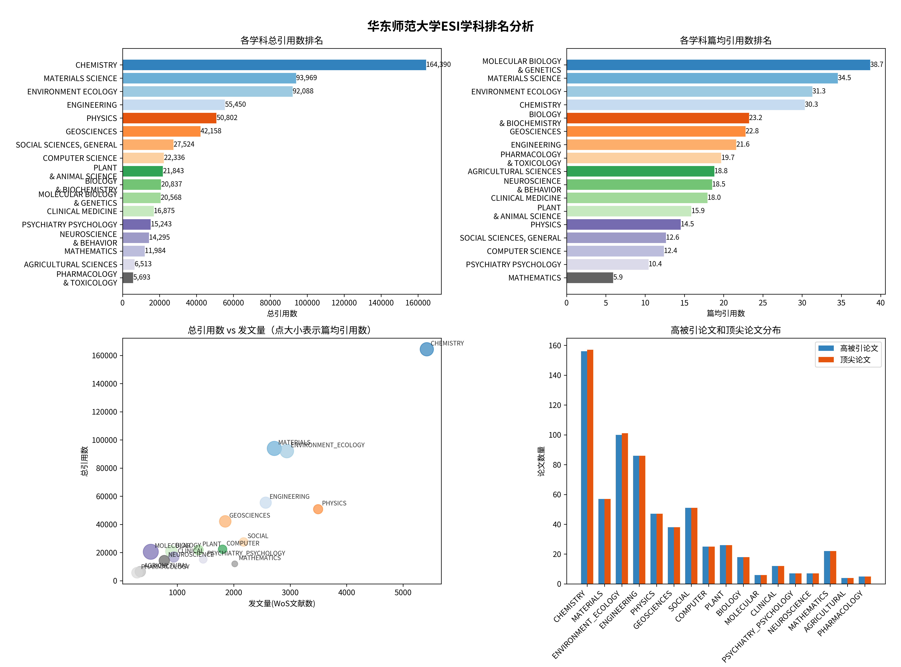

# 华东师范大学 ESI 学科情况分析

## 总体表现
华东师范大学共有17个学科进入ESI全球前1%，展现了强大的学科实力。其中：
- 1个学科进入全球前100名
- 9个学科排名全球101-500名
- 5个学科排名全球501-1000名
- 2个学科排名全球1001-5000名

数据图示：

#### 高排名学科（前 100 名）

1. 化学（CHEMISTRY） - 第 90 名

- 论文总数：5420 篇
- 总引用次数：164390 次
- 高被引论文：157 篇
- 热点论文：9 篇
  
#### 中高排名学科（100-500 名）

1. 地球科学（GEOSCIENCES） - 第 275 名

- 论文总数：1850 篇
- 总引用次数：42158 次
- 高被引论文：38 篇

2. 材料科学（MATERIALS SCIENCE） - 第 196 名

- 论文总数：2720 篇
- 总引用次数：93969 次
- 高被引论文：57 篇
- 热点论文：未显示

3. 环境生态学（ENVIRONMENT_ECOLOGY） - 第 130 名

- 论文总数：2941 篇
- 总引用次数：92088 次
- 高被引论文：101 篇
- 热点论文：1 篇

4. 数学（MATHEMATICS） - 第 115 名

- 论文总数：2019 篇
- 总引用次数：11984 次
- 高被引论文：22 篇
- 热点论文：0 篇

5. 工程学（ENGINEERING） - 第 317 名

- 论文总数：2567 篇
- 总引用次数：55450 次
- 高被引论文：86 篇

6. 植物学与动物学（PLANT & ANIMAL SCIENCE） - 第 395 名

- 论文总数：1375 篇
- 总引用次数：21843 次
- 高被引论文：26 篇

7. 计算机科学（COMPUTER SCIENCE） - 第 207 名

- 论文总数：1803 篇
- 总引用次数：未完全显示
- 高被引论文：25 篇
- 热点论文：2 篇

8. 社会科学总论（SOCIAL SCIENCES, GENERAL） - 第 314 名

- 论文总数：2176 篇
- 总引用次数：27524 次
- 高被引论文：51 篇
- 热点论文：3 篇

9. 精神病学与心理学（PSYCHIATRY_PSYCHOLOGY） - 第 467 名

- 论文总数：1460 篇
- 总引用次数：15243 次
- 高被引论文：7 篇
- 热点论文：1 篇

#### 中等排名学科（500-1000 名）

1. 生物学与生物化学（BIOLOGY & BIOCHEMISTRY） - 第 721 名

- 论文总数：897 篇
- 总引用次数：20837 次
- 高被引论文：18 篇

2. 物理学（PHYSICS） - 第 522 名

- 论文总数：3495 篇
- 总引用次数：50802 次
- 高被引论文：47 篇

3. 分子生物学与遗传学（MOLECULAR BIOLOGY & GENETICS） - 第 867 名

- 论文总数：532 篇
- 总引用次数：20568 次
- 高被引论文：6 篇
- 热点论文：1 篇

4. 神经科学与行为学（NEUROSCIENCE & BEHAVIOR） - 第 853 名

- 论文总数：771 篇
- 总引用次数：14295 次
- 高被引论文：7 篇

5. 农业科学（AGRICULTURAL SCIENCES） - 第 845 名

- 论文总数：346 篇
- 总引用次数：6513 次
- 高被引论文：4 篇
#### 其他学科（1000 名以外）

1. 临床医学（CLINICAL MEDICINE） - 第 2852 名

- 论文总数：940 篇
- 总引用次数：16875 次
- 高被引论文：12 篇

2. 药理学与毒理学（PHARMACOLOGY & TOXICOLOGY） - 第 1064 名

- 论文总数：289 篇
- 总引用次数：5693 次
- 高被引论文：5 篇

## 优势学科分析

1. 顶尖学科（国际排名前100）
   - 化学：全球第90名，总引用数164,390次，篇均引用30.33次，表现最为突出

2. 高影响力学科（篇均引用数前5）
   - 分子生物学与遗传学：38.66次/篇
   - 材料科学：34.55次/篇
   - 环境生态学：31.31次/篇
   - 化学：30.33次/篇
   - 生物学与生物化学：23.23次/篇

3. 高产学科（发文量前5）
   - 化学：5,420篇文献
   - 物理学：3,495篇文献
   - 环境生态学：2,941篇文献
   - 材料科学：2,720篇文献
   - 工程学：2,567篇文献
  

## 学科发展特点

1. 理工科优势明显：化学、材料科学、环境生态学等理工科表现突出
2. 研究影响力显著：多个学科篇均引用数超过20次
3. 国际竞争力强：多数学科排名进入全球前1000名

## 总结

华东师范大学在 ESI 学科排名中表现良好，特别是在以下学科具有较强实力：
- 化学、材料科学、环境生态学和数学等学科进入全球前 200 名
- 工程学、计算机科学、环境生态学等学科排名在 300 名左右
- 在物理、数学等基础学科方面表现突出
- 在心理学、社会科学等人文社科领域也有不俗表现
  
整体来看，华东师范大学作为一所综合性研究型大学，在多个学科领域都具有较强的科研实力和国际影响力。

