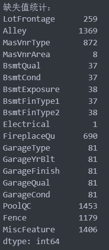
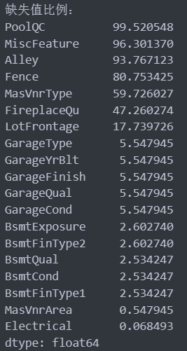
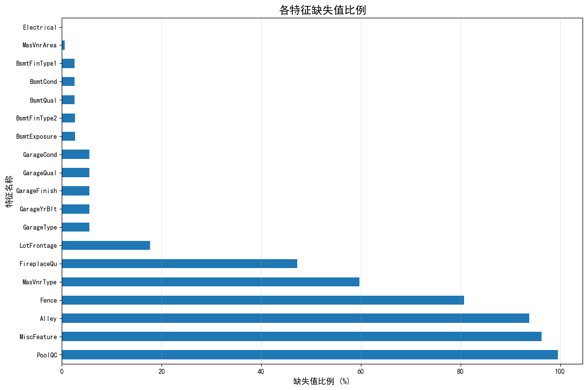
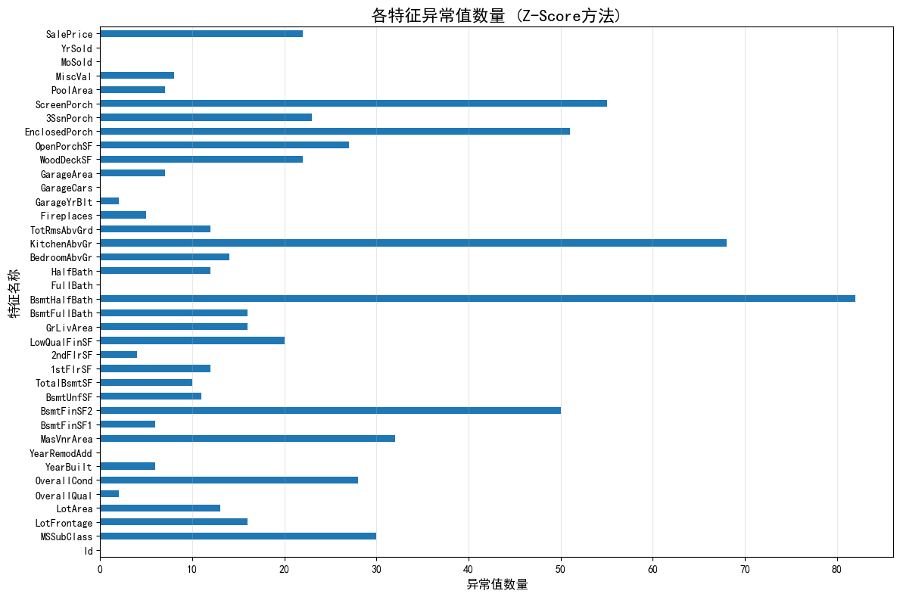
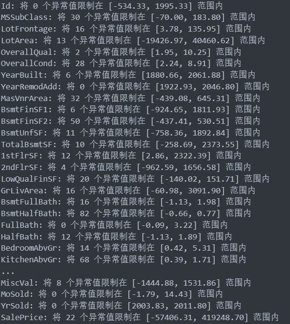
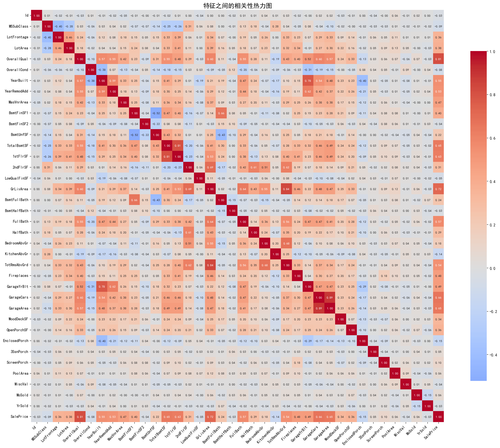
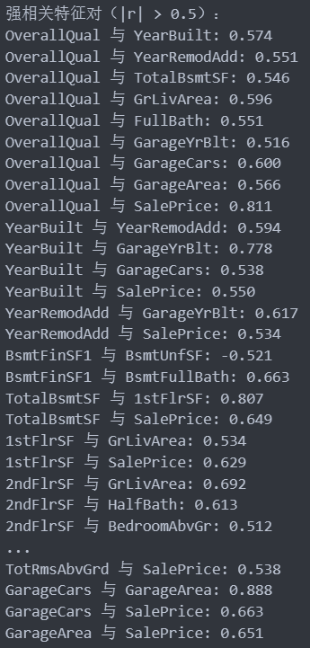
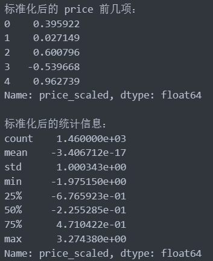
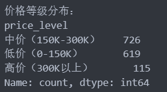
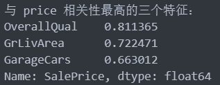

# 第二次作业实验文档
唐一嘉 10245101434
### 数据概览

- 共有包含 ID 在内的 81 个属性
- 其中数值型属性有 38 个（float64(3), int64(35)），类别型属性有 43 个

### 数据预处理

#### 检测缺失值

- 使用三种方法展示缺失值
  - 缺失值个数
    ```python
    # 检测缺失值
    print("缺失值统计：")
    missing_values = df.isnull().sum()
    missing_values = missing_values[missing_values > 0]
    print(missing_values)
    ```
    输出结果：
    
  - 缺失值比例
    ```python
    # 缺失值比例
    print("\n缺失值比例：")
    missing_percentage = (df.isnull().sum() / len(df)) * 100
    missing_percentage = missing_percentage[missing_percentage > 0]
    missing_percentage = missing_percentage.sort_values(ascending=False)
    print(missing_percentage)
    ```
    输出结果：
    
  - 缺失值条形图
    ```python
    # 绘制缺失值比例条形图
    plt.figure(figsize=(12, 8))
    missing_percentage.plot(kind="barh")
    plt.title("各特征缺失值比例", fontsize=16)
    plt.xlabel("缺失值比例 (%)", fontsize=12)
    plt.ylabel("特征名称", fontsize=12)
    plt.grid(axis="x", alpha=0.3)
    plt.tight_layout()
    plt.show()
    ```
    输出结果：
    
- 缺失值处理

  - 先删除缺失值比例超过 95% 的特征
    ```python
    # 先找出缺失比例大于 95%的列并删除
    high_missing_cols = missing_percentage[missing_percentage > 95].index.tolist()
    if high_missing_cols:
    print(f"\n 删除缺失比例大于 95%的列: {high_missing_cols}")
    df.drop(columns=high_missing_cols, inplace=True)
    ```
  - 对数值型特征使用 KNN 填充

    ```python
    # 对数值型特征使用 KNN 填充
    if len(numeric_columns) > 0: # 先用中位数填充，确保 KNN 能够运行
    for col in numeric_columns:
    if df[col].isnull().sum() > 0:
    df[col].fillna(df[col].median(), inplace=True)

        # 使用KNN进一步优化填充
        knn_imputer = KNNImputer(n_neighbors=5)
        df[numeric_columns] = knn_imputer.fit_transform(df[numeric_columns])

    ```

  - 对于分类特征，标记为"Unknown"
    ```python
    # 对于分类特征，标记为"Unknown"
    for col in categorical_columns:
    if df[col].isnull().sum() > 0:
    df[col].fillna("Unknown", inplace=True)
    ```

#### 检测异常值

- 采用了 Z-Score 方法检测异常值，同时输出了文本数据（篇幅原因未贴在实验文档中）与条形图

  ```python
  # Z-Score方法检测异常值
  numeric_cols = df.select_dtypes(include=[np.number]).columns

  print("\n 使用 Z-Score 方法检测异常值：")
  zscore_outliers_count = {}
  for col in numeric_cols:
  z_scores = np.abs((df[col] - df[col].mean()) / df[col].std())
  outliers = df[z_scores > 3]
  zscore_outliers_count[col] = len(outliers)
  print(f"{col} 的异常值数量: {len(outliers)}")

  # 绘制Z-Score异常值数量条形图
  plt.figure(figsize=(12, 8))
  zscore_outliers_series = pd.Series(zscore_outliers_count)
  zscore_outliers_series.plot(kind="barh")
  plt.title("各特征异常值数量 (Z-Score方法)", fontsize=16)
  plt.xlabel("异常值数量", fontsize=12)
  plt.ylabel("特征名称", fontsize=12)
  plt.grid(axis="x", alpha=0.3)
  plt.tight_layout()
  plt.show()
  ```

  输出结果：
  

- 异常值处理方法采用的也是 Z-score 法

  ```python
  # 使用Z-score法处理异常值
  print("\n使用Z-score法处理异常值")
  for col in numeric_cols: # 计算 Z-score
    z_scores = np.abs((df[col] - df[col].mean()) / df[col].std())
    outliers_mask = z_scores > 3

    # 将异常值替换为边界值
    mean_val = df[col].mean()
    std_val = df[col].std()
    lower_bound = mean_val - 3 * std_val
    upper_bound = mean_val + 3 * std_val

    # 将超出边界的值替换为边界值
    df.loc[z_scores > 3, col] = np.clip(df.loc[z_scores > 3, col], lower_bound, upper_bound)

    # 或者分别替换上下边界外的值
    df.loc[df[col] < lower_bound, col] = lower_bound
    df.loc[df[col] > upper_bound, col] = upper_bound

    print(f"{col}: 将 {outliers_mask.sum()} 个异常值限制在 [{lower_bound:.2f}, {upper_bound:.2f}] 范围内")
  ```

  输出结果：
  

#### 特征间的相关性分析

- 只分析数值型特征之间的相关性
- 使用热力图可视化特征相关性

  ```python
  # 绘制热力图
  plt.figure(figsize=(20, 16))
  sns.heatmap(
  correlation_matrix,
  annot=True,
  cmap="coolwarm",
  center=0,
  square=True,
  fmt=".2f",
  cbar_kws={"shrink": 0.8},
  annot_kws={"size": 8},
  )
  plt.title("特征之间的相关性热力图", fontsize=16)
  plt.xticks(rotation=45, ha="right", fontsize=10)
  plt.yticks(rotation=0, fontsize=10)
  plt.tight_layout()
  plt.show()
  ```

  输出结果：
  

- 将相关性绝对值大于 0.5 的两个特征认为是强相关性特征

  ```python
  # 找出所有 |r| > 0.5 的特征对
  strong_pairs = []
  for i in range(len(numeric_cols)):
    for j in range(i + 1, len(numeric_cols)):
        col1, col2 = numeric_cols[i], numeric_cols[j]
        corr = correlation_matrix.loc[col1, col2]
        if abs(corr) > 0.5:
            strong_pairs.append((col1, col2, corr))


    # 显示结果

    print("强相关特征对（|r| > 0.5）：")
    for pair in strong_pairs:
    print(f"{pair[0]} 与 {pair[1]}: {pair[2]:.3f}")
  ```

  输出结果：
  

#### 对 price 属性进行标准化

- 使用的是 z-score 标准化

  ```python
  # 创建标准化器
  scaler = StandardScaler()

  # 对 SalePrice 进行标准化（z-score 标准化）
  df["price_scaled"] = scaler.fit_transform(df[["SalePrice"]])

  print("标准化后的 price 前几项：")
  print(df["price_scaled"].head())

  # 查看标准化统计信息
  print("\n 标准化后的统计信息：")
  print(df["price_scaled"].describe())
  ```

  输出结果：
  

#### 根据 price 属性进行离散化

- 使用的是等宽分桶的方法
  ```python
  # 使用等宽分桶对数据离散化
  bins = [0, 150000, 300000, np.inf]
  labels = ["低价（0-150K）", "中价（150K-300K）", "高价（300K以上）"]
  df["price_level"] = pd.cut(df["SalePrice"], bins=bins, labels=labels)
  print("价格等级分布：")
  print(df["price_level"].value_counts())
  ```
  输出结果：
  

#### 与房价 price 相关性最高的三个特征

- 直接取相关性矩阵中 SalePrice 行，然后找到数值绝对值最大的三个特征，注意排除自己（自己与自己相关性总为 1）

  ```python
  # 获取 price 与其他特征的相关性排序
  price_corr = correlation_matrix["SalePrice"].abs().sort_values(ascending=False)
  top_3_features = price_corr[1:4]  # 排除自己
  print("与 price 相关性最高的三个特征：")
  print(top_3_features)
  ```
  输出结果：
  

- 分析

  1. OverallQual
     OverallQual 评价房屋的整体材料和装修质量，评分范围从 1 到 10。这个特征与房价有极强的正相关关系，因为高质量的材料和精良的装修直接决定了房屋的价值。购房者在选择房屋时，通常会优先考虑房屋的质量，这是影响房价的最核心因素之一，质量高的房屋不仅居住舒适度更高，而且具有更好的耐久性和保值性。

  1. GrLivArea
     GrLivArea 表示地面以上的居住面积，不包括地下室。与房价呈现强正相关关系，因为根据常识来讲，房屋面积越大，价格通常越高。居住面积直接影响房屋的实用性，是绝大多数购房者关注的重点指标。

  1. GarageCars（车库容量）
     GarageCars 表示车库可以容纳的汽车数量，反映了车库大小，与房价呈较强正相关。拥有车库不仅能停放车辆，还提供额外的储物空间，甚至车库还可以用作生活用区，拥有和普通居住区域相近的价值。因此，其与房价有较强正相关的关系。
