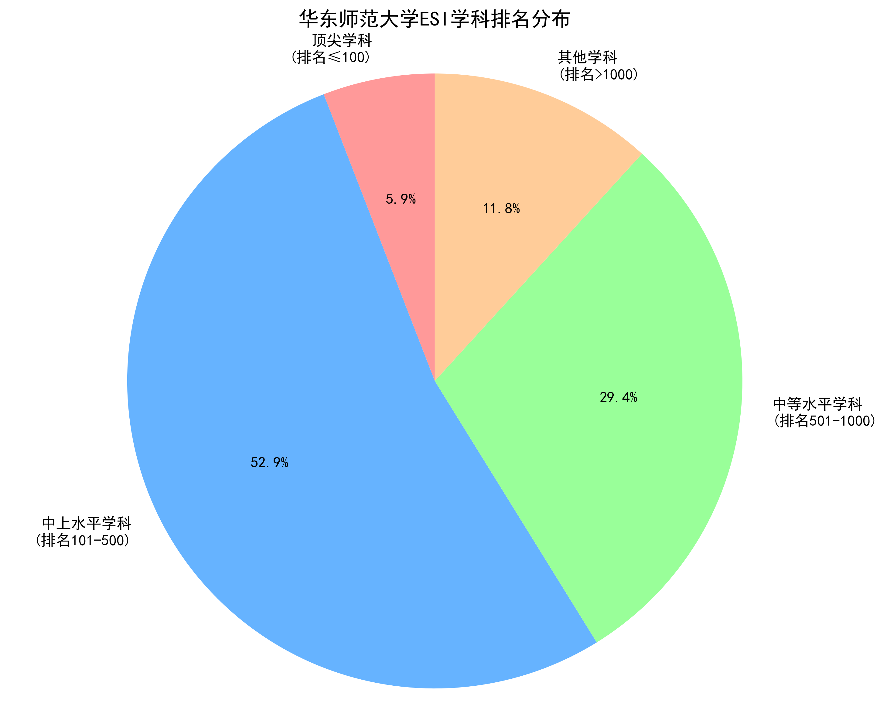
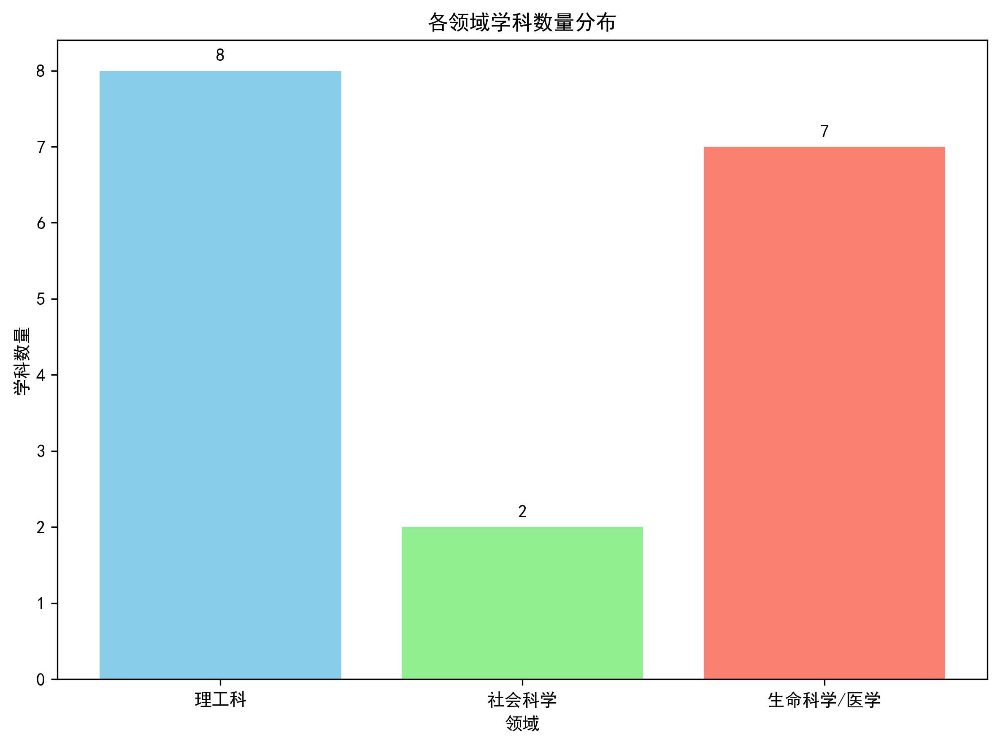
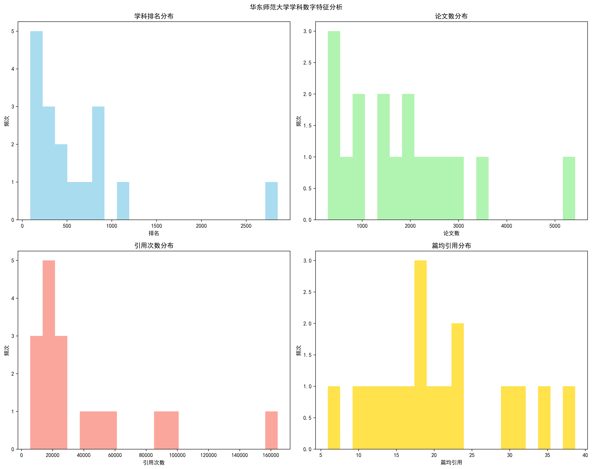
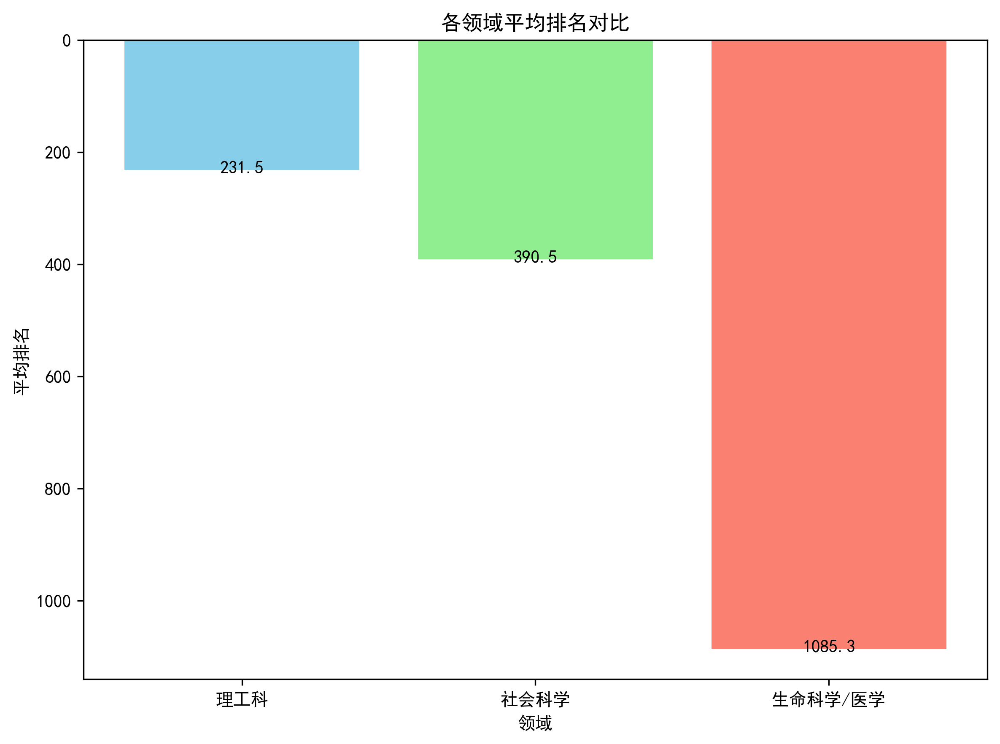
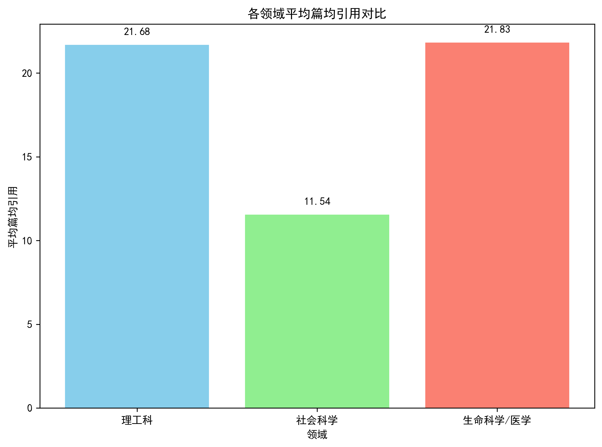
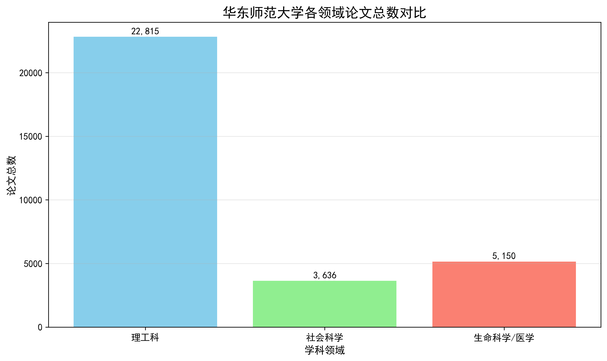
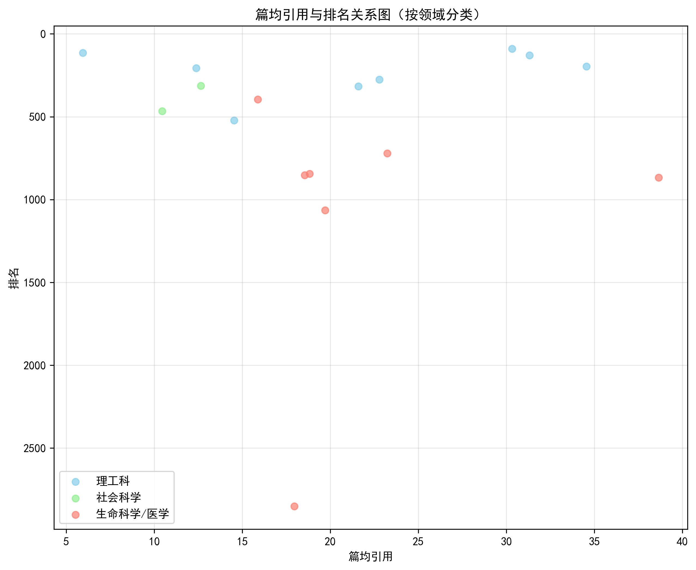
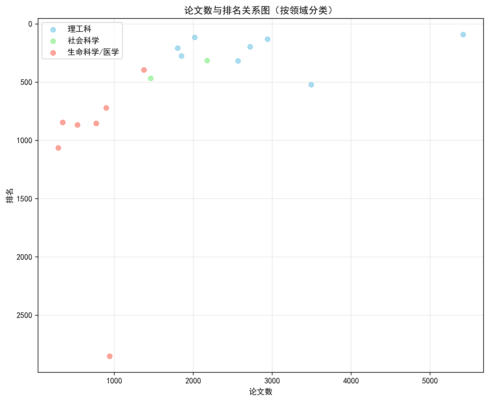
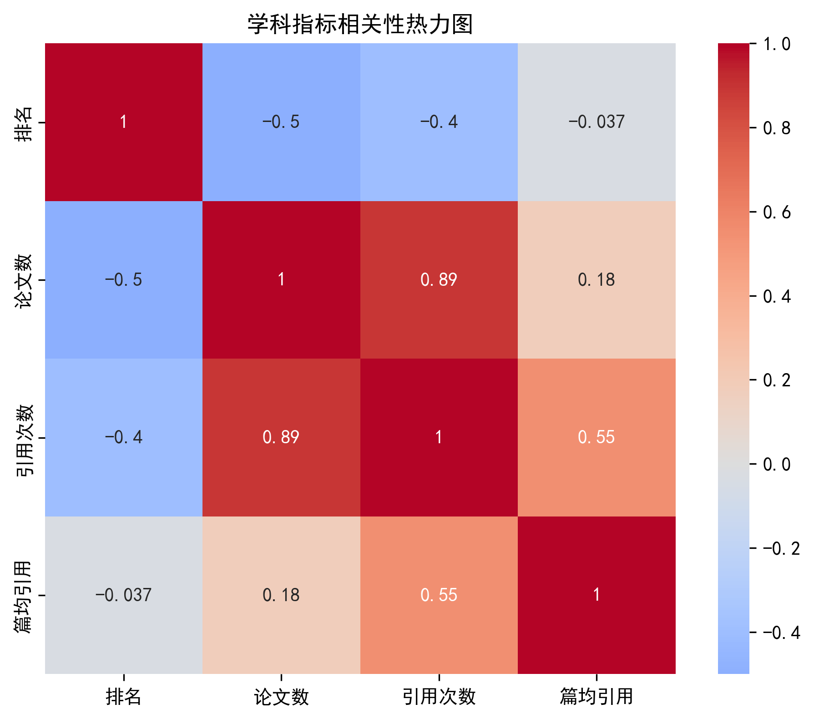

# 华东师范大学学科画像分析

## 1.数据总览

### 1.1 总体概况

华东师范大学目前有 17 个学科进入 ESI 全球前 1%，显示出较强的综合学科实力。这些学科涵盖了多个领域，体现出学校作为综合性研究型大学的特点。

### 1.2 学科排名分布

根据数据分析，华东师范大学的学科排名分布如下：

这表明华东师范大学大部分学科处于国际中上水平，且有一个学科进入了全球前 100 名。

### 1.3 进入前 500 名的学科领域

华东师范大学共有 10 个学科进入 ESI 全球前 500 名，具体包括：

- CHEMISTRY（化学）
- MATHEMATICS（数学）
- ENVIRONMENT ECOLOGY（环境生态学）
- MATERIALS SCIENCE（材料科学）
- COMPUTER SCIENCE（计算机科学）
- GEOSCIENCES（地球科学）
- SOCIAL SCIENCES, GENERAL（社会科学总论）
- ENGINEERING（工程学）
- PLANT & ANIMAL SCIENCE（植物与动物科学）
- PSYCHIATRY PSYCHOLOGY（精神病学与心理学）

其中化学学科排名最为突出，位列全球第 90 名。

### 1.4 学科领域覆盖面

从学科分布来看，华东师范大学的学科结构较为均衡：

这体现了华东师范大学作为师范类院校向综合性研究型大学发展的特点，理工科实力较强，同时在社会科学领域有一定的发展。

### 1.5 研究实力表现

华东师范大学的研究产出数据显示了良好的学术影响力：

| 指标     | 平均值             | 中位数  |
| -------- | ------------------ | ------- |
| 排名     | 601.7647058823529  | 395.0   |
| 论文数   | 1858.8823529411766 | 1803.0  |
| 引用次数 | 40151.05882352941  | 21843.0 |
| 篇均引用 | 20.548249292424263 | 18.82   |

这些数据表明华东师范大学不仅在论文产量方面表现良好，在学术影响力方面也具有不错的水平。

### 1.6 优势学科分析

从具体学科排名数据看，华东师范大学的优势学科主要集中在以下几个领域：

1. **化学**：全球排名第 90 位，是学校最具优势的学科之一
2. **数学**：全球排名第 115 位，表现出色
3. **材料科学**：全球排名第 196 位，研究影响力显著
4. **环境生态学**：全球排名第 130 位，具有较强竞争力
5. **工程学**：全球排名第 317 位，发展势头良好

## 2. 特征分析

### 2.1 各领域平均排名对比

1. **理工科**领域的平均排名为 231.5，是三个领域中最高的。这表明理工科领域的学科整体水平较高，在国际上的竞争力较强。

2. **社会科学**领域的平均排名为 390.5，虽然低于理工科领域，但仍然处于相对较高的水平。这说明社会科学领域的学科在国际上也有一定的竞争力。

3. **生命科学/医学**领域的平均排名为 1085.3，明显高于其他两个领域。这可能反映了生命科学/医学领域的研究在国际上的影响力相对较低，或者该领域的研究成果更注重理论探讨而非实际应用。

4. 从整体来看，华东师范大学在理工科领域的学科整体水平最高，其次是社会科学领域，而生命科学/医学领域的学科整体水平相对较低。

### 2.2 各领域平均篇均引用次数对比

1. **理工科**领域的平均篇均引用次数为 21.68 次，处于较高水平。这表明理工科领域的研究成果具有较强的学术影响力和认可度。

2. **生命科学/医学**领域的平均篇均引用次数为 21.83 次，略高于理工科领域，同样处于较高水平。这说明生命科学/医学领域的研究成果在国际上也具有较高的影响力。

3. **社会科学**领域的平均篇均引用次数为 11.54 次，明显低于理工科和生命科学/医学领域。这可能反映了社会科学领域的研究在国际上的影响力相对较低，或者该领域的研究成果更注重理论探讨而非实际应用。

4. 从整体来看，华东师范大学在理工科和生命科学/医学领域的研究成果具有较强的学术影响力，而社会科学领域的研究成果影响力相对较弱。

### 2.3 各领域论文数量对比

1. **理工科**领域的论文总数最多，达到了 22,815 篇，占所有学科论文总数的绝大部分。这表明华东师范大学在理工科领域的研究产出非常突出，是学校科研实力最强的领域。

2. **生命科学/医学**领域的论文总数为 5,150 篇，虽然远低于理工科，但仍然是一个重要的研究领域，显示出学校在生命科学和医学方面的研究也具有相当的实力。

3. **社会科学**领域的论文总数最少，仅为 3,636 篇，这说明相比于理工科和生命科学/医学领域，社会科学领域的研究产出相对较少。

4. 从整体来看，华东师范大学的研究重心明显偏向于理工科领域，同时，学校在生命科学/医学领域也有一定的研究基础，而在社会科学领域的研究则相对较弱。这种分布格局反映了学校在不同学科领域的资源配置、师资力量以及科研投入等方面的差异。

### 2.4 篇均引用与排名关系图

#### 2.4.1 **数据分布特征**

- **理工科**（蓝色点）：

  - 篇均引用范围较广，从约 5 到 35 之间。
  - 排名集中在 500 以内，部分机构排名非常靠前（如接近 0），说明理工科中存在高影响力的研究成果。
  - 整体趋势显示，篇均引用较高的机构通常排名更靠前。

- **社会科学**（绿色点）：

  - 数据点较少
  - 表明社会科学领域的研究整体篇均引用较低，且影响力相对有限。
  - 但相对较低的篇均引用数却对应着较高的排名，与其他两个领域有显著不同。可能是因为该领域机构较少或篇均引用普遍较低

- **生命科学/医学**（红色点）：
  - 篇均引用普遍较高，集中在 15~40 之间。
  - 排名跨度较大，既有排名靠前的机构（如排名约 1000），也有排名靠后的机构（如排名超过 2500）。
  - 尽管篇均引用高，但部分机构排名并不理想

#### 2.4.2 **趋势与规律**

- **正相关趋势**：总体来看，篇均引用越高，排名越靠前，尤其是在理工科和生命科学/医学领域表现明显。
- **例外情况**：
  - 生命科学/医学中有少数机构虽然篇均引用很高（如接近 40），但排名却较差（如 2500 以上），这可能是因为这些机构在其他维度（如科研产出数量、国际合作等）未达到顶尖水平。
  - 社会科学领域数据稀疏，难以判断其规律性。

#### 2.4.3 **结论**

- 高篇均引用并不总是直接对应高排名，说明排名还受到其他因素影响。

### 2.5 论文数与排名关系图

#### 2.5.1 **数据分布特征**

- **理工科**（蓝色点）

  - 论文数集中在 **1500~3500** 篇之间，部分机构接近 **5500** 篇。
  - 排名普遍较好，多数位于 **500 名以内**，甚至有机构排名接近第 0 位（即全球顶尖水平）。
  - 整体趋势显示：**论文数量越多，排名越靠前**，表明理工科领域在高产和高质量之间实现了良好平衡。

- **社会科学**（绿色点）

  - 数据点较少，仅有一个明显点位于论文数约 **2200** 篇、排名约 **500** 的位置。
  - 表明社会科学领域的研究产出相对有限，且整体影响力不如理工科。
  - 尽管论文数不高，但其排名仍处于中上游水平，可能反映该领域研究质量较高或国际认可度较强。

- **生命科学/医学**（红色点）

  - 论文数分布在 **800~1000** 篇左右，其中有一项显著低于其他点（约 900 篇），但排名却较差（超过 2700）。
  - 多数机构的排名集中在 **1000~1500** 之间，少数机构排名更差（如超过 2500）。
  - 虽然论文数量不算低，但排名普遍偏低，说明该领域的研究成果在国际上的影响力仍有待提升。

#### 2.5.2 **趋势与规律**

- **负相关趋势**(排名数越小，排名越高)：

  - 在**理工科**领域，论文数与排名呈明显的负相关（即论文数越多，排名越高），说明高产是推动排名提升的重要因素。
  - **社会科学**虽数据稀疏，但单个点显示其在较低论文数下仍能取得较好排名，可能得益于研究质量和影响力。
  - **生命科学/医学**领域也表现出大致的负相关，但存在个别例外

- **例外情况**：
  - 生命科学/医学中存在一个极端案例：论文数约为 900 篇，但排名达 2700+。这可能是因为该机构的研究方向较为特殊，或者尚未形成足够的学术积累。

### 2.6 各学科指标相关性

#### 2.6.1 **热力图解读**

- **颜色含义**：

  - 红色越深 → 正相关性越强（接近 +1）
  - 蓝色越深 → 负相关性越强（接近 -1）
  - 灰色 → 相关性接近于 0

- **对角线为 1**：表示每个变量与自身完全相关，符合预期。

#### 2.6.2 **关键相关性分析**

##### ✅ **正相关关系**

| 指标对                   | 相关系数 | 分析                                                                                     |
| ------------------------ | -------- | ---------------------------------------------------------------------------------------- |
| **论文数 vs 引用次数**   | `0.89`   | 极强正相关，说明论文发表越多，总引用次数也越高，表明高产研究通常伴随较高影响力。         |
| **引用次数 vs 篇均引用** | `0.55`   | 中等正相关，说明总引用次数较高的学科，其单篇论文的平均被引次数也相对较高，但并非绝对。   |
| **论文数 vs 篇均引用**   | `0.18`   | 弱正相关，说明论文数量多并不必然带来更高的篇均引用，可能受研究质量、领域差异等因素影响。 |

> **结论**：  
> 学术产出（论文数）是推动总引用量的关键因素，而篇均引用则更多反映研究质量，两者之间存在一定的独立性。

---

##### ❌ **负相关关系**

| 指标对               | 相关系数 | 分析                                                                                       |
| -------------------- | -------- | ------------------------------------------------------------------------------------------ |
| **排名 vs 论文数**   | `-0.5`   | 明显负相关，说明论文数量越多，排名越靠前（即排名数值越小）。这表明高产有助于提升国际排名。 |
| **排名 vs 引用次数** | `-0.4`   | 中度负相关，说明总引用次数越高，排名越靠前，体现学术影响力的直接作用。                     |
| **排名 vs 篇均引用** | `-0.037` | 几乎无相关性，说明篇均引用对排名的影响非常有限。                                           |

> **结论**：  
> 排名主要受**论文数量**和**总引用次数**驱动，而**篇均引用**虽然重要，但在当前数据中并未显著影响排名。

---

#### 2.6.3 **综合趋势总结**

- **排名的核心驱动力**：

  - 主要由**论文数量**和**总引用次数**决定。
  - 篇均引用虽有贡献，但作用较弱，可能因为不同学科领域的引用习惯差异较大。

- **高质量与高产的关系**：

  - 高产（论文数）能有效提升总引用和排名；
  - 但高产不等于高质量（篇均引用），部分学科可能存在“数量优先”的现象。

- **篇均引用的独特性**：
  - 与其他指标相关性较低，说明它更侧重于**研究深度**或**创新性**，而非单纯的产出规模。

---

#### 2.6.4 **实际意义与建议**

- **对于学校战略规划**：

  - 应继续鼓励**高水平科研产出**，尤其是在理工科和生命科学/医学领域扩大论文数量。
  - 同时注重提升**研究质量**，避免“唯数量论”，可通过加强国际合作、优化资源配置来提高篇均引用。

- **对于学科发展**：
  - 对于排名靠后但篇均引用高的学科，应重点支持其成果转化与国际传播，以提升整体影响力。
  - 对于论文数量大但篇均引用低的学科，需反思研究方向是否过于分散，或是否存在“水文”问题。

#### 2.6.5 **总结**

> 该热力图表明：  
> **华东师范大学的学科排名主要由论文数量和总引用次数驱动**，而篇均引用虽有一定价值，但对排名影响较小。未来应在保持高产的同时，进一步提升研究质量，实现“量质并重”的可持续发展。

## 3. 总结

### 3.1 核心发现

华东师范大学已发展成为一所具有较强综合实力的研究型大学，学科布局日趋均衡。其优势主要体现在以下几个方面：

1. **学科覆盖面广**：拥有 17 个 ESI 全球前 1%学科，其中 10 个进入全球前 500 名，化学学科更是跻身全球前 100 名（第 90 位），显示了强劲的学科实力。

2. **理工科优势明显**：无论是从论文数量（22,815 篇）、平均排名（231.5）还是篇均引用（21.68 次）来看，理工科都是学校最具竞争力的领域，在国际上享有较高声誉。

3. **生命科学/医学发展潜力大但需加强**：虽然篇均引用达到 21.83 次，显示出良好的研究质量，但平均排名仅为 1085.3，表明其国际影响力有待提升。

4. **社会科学保持强势**：虽然篇均引用（11.54 次）明显低于其他领域，论文数量也最少（3,636 篇），但是排名保持在较高位次，证明了学校在人文社科方面的强势。

### 3.2 关键洞察

通过多维度数据分析发现，学科排名主要由**论文数量**和**总引用次数**驱动，相关系数分别为-0.5 和-0.4，而篇均引用对排名的影响微乎其微（相关系数仅为-0.037）。这表明在当前评估体系下，研究产出规模比单篇论文质量对排名的影响更为直接。

### 3.3 发展建议

1. **继续保持理工科优势**：维持高水平科研产出，巩固国际领先地位
2. **大力提升生命科学/医学领域**：在保持研究质量的基础上，扩大研究规模和国际影响力
3. **加强社会科学建设**：增加资源投入，提高研究产出和国际可见度

总体而言，华东师范大学已经建立了良好的学科发展格局，未来应继续发挥优势学科的引领作用，同时补强相对薄弱领域，推动学校整体学科水平再上新台阶。
