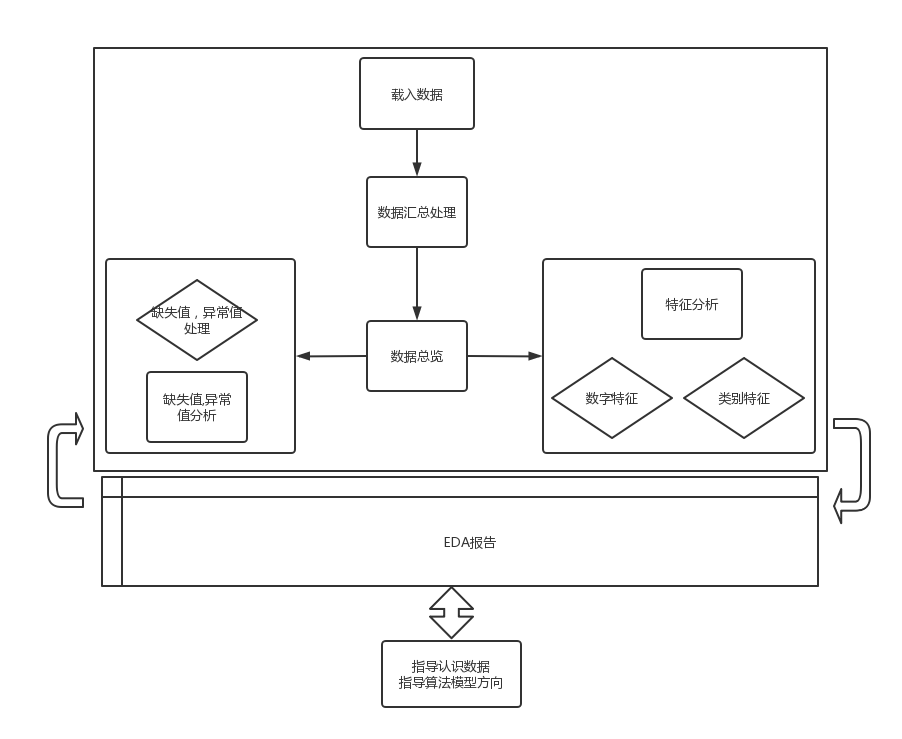
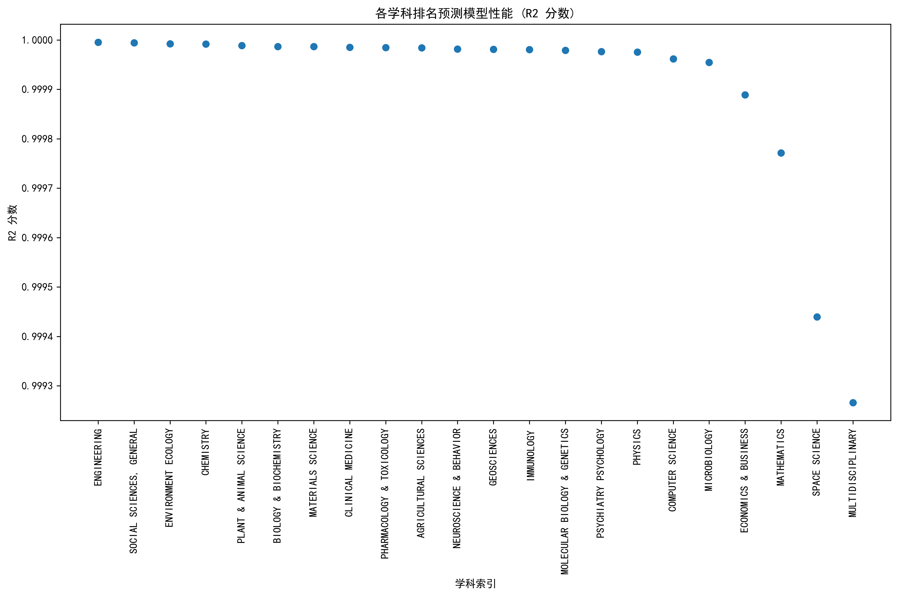

# 第五次作业实验文档

## 1. 全球高校分类及与华东师范大学相似高校分析

### 1.1 实验目标

1. 分析全球高校可以大致分为哪几类
2. 分析出与华东师范大学类似的高校

### 1.2 实验原理

1. 根据第四次作业中已经得到的数据分析得出全球搞笑的分类情况，并给出相应的分类结果。
2. 采用相似度计算的方法，通过比较华东师范大学和其他各高校在以下指标上的表现来评估相似度：

   - 进入 ESI 前 1%的学科数量
   - 各学科排名分布情况（顶尖/中上/中等/其他）
   - 学科领域覆盖范围（理工科、文科、医科等比例）
   - 研究实力指标（论文总数、引用次数总数、平均每篇论文引用次数）
   - 进入前 500 名的学科列表

### 1.3 实验步骤([ECNUCompareData.py](./ECNUCompareData.py)+[ECNUSimilarSearch.py](./ECNUSimilarSearch.py))

#### 1.3.1 分析全球高校可以大致分为哪几类

1. 确定分类指标
2. 规定判定标准
3. 基于数据进行分类

#### 1.3.2 分析出与华东师范大学类似的高校

1.  从数据库中获取华东师范大学的各项指标数据并保存到 CSV 文件（[ecnu_indicators.csv](./QueryData/ecnu_indicators.csv)）
2.  获取所有大学的信息列表
3.  对每所大学计算与华东师范大学相同的指标
4.  计算各大学与华东师范大学的相似度
5.  按相似度排序，找出最相似的 10 所大学
6.  将结果保存到 CSV 文件中

### 1.4 实验结果

[全球高校分类+和华东师范大学类似的高校.md](./全球高校分类+和华东师范大学类似的高校.md)

## 2. 华东师范大学学科画像分析

### 2.1 实验目标

通过探索性分析的方式，从多个角度对华东师范大学进行学科画像

### 2.2 实验原理

本实验采用探索性数据分析（EDA）方法，通过对华东师范大学 ESI 学科数据的多维度分析，构建全面的学科画像。主要分析维度包括：

- 描述性统计分析
- 分布可视化分析
- 相关性分析
- 领域对比分析

采取的步骤为：

### 2.3 实验步骤（[ECNUDataEvaluate.py](./ECNUDataEvaluate.py)）

1. 载入华东师范大学 ESI 学科数据
2. 进行数据预处理和指标计算（显然数据中无缺失值，无异常值，因此可以跳过缺失值异常值处理步骤）
3. 进行描述性统计分析（求平均值中位数等）
4. 绘制各类可视化图表：
   - 学科排名分布饼状图
   - 各领域论文总数柱状图
   - 数字特征分布直方图
   - 相关性热力图
   - 领域对比图等
5. 分析不同学科领域的表现差异

### 2.4 实验结果

[华东师范大学学科画像.md](./华东师范大学学科画像.md)

## 3. 学科排名预测模型构建

### 3.1 实验目标

利用数据建模的方式，构建能够较好预测学科排名位置的模型

### 3.2 实验原理

采用的数据：

- 使用各学科前 60%的数据作为训练集
- 后 20%的数据作为测试集
- 剩余 20%作为验证集

本实验采用机器学习回归算法构建学科排名预测模型，通过以下特征预测学科排名：

- Documents（论文数）
- Cites（引用次数）
- CitesPerPaper（篇均引用）
- TopPapers（高水平论文数）

实验中尝试了三种模型：

1. 线性回归（Linear Regression）
2. 随机森林（Random Forest）
3. 梯度提升（Gradient Boosting）

使用 R2 分数作为主要评估指标，同时参考 MSE 和 MAE 指标。

### 3.3 实验步骤（[PredictModel.py](./PredictModel.py)）

1. 加载并预处理各学科数据
2. 对数据进行清洗和格式化
3. 将数据集按 6:2:2 的比例划分为训练集、验证集和测试集
4. 对特征进行标准化处理
5. 分别训练三种不同的回归模型
6. 使用网格搜索进行超参数调优
7. 在验证集上评估模型性能，选择最佳模型
8. 在测试集上进行最终评估
9. 分析特征重要性
10. 将结果可视化并保存模型

### 3.4 实验结果

- 实验结果表明：

  1. 不同学科的最佳预测模型可能不同
  2. 随机森林和梯度提升模型通常表现优于线性回归模型
  3. Cites（引用次数）是最重要的特征，在所有模型中重要性均大于 0.99。由此可得该排名数据是由引用次数排名的:-)。
  4. 模型的预测性能在不同学科间存在差异，部分学科可以达到较高的预测精度，性能与数据样本量显著相关。经观察发现，预测性能较差的模型普遍存在数据集过少的问题（如 Space Science 仅 236 条数据，Multidisciplinary 仅 216 条数据，因此得到的模型的 r2 值相对较低）。

  

- 实验得到的模型保存在[saved_models](./saved_models/)文件夹中
- 实验得到的可视化数据保存在[model_results](./model_results/)文件夹中
- 有关各个学科的最佳模型以及对应指标在[subject_ranking_model_results.csv](./model_results/subject_ranking_model_results.csv)文件中
