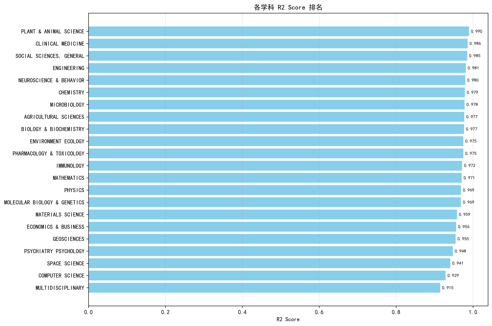
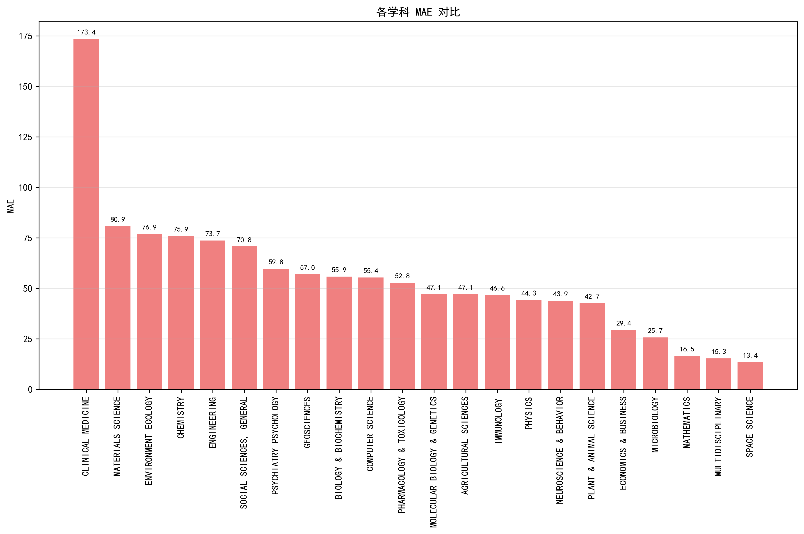
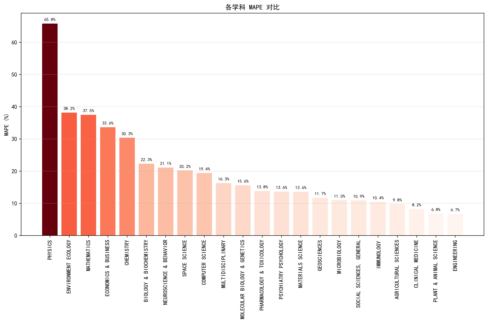
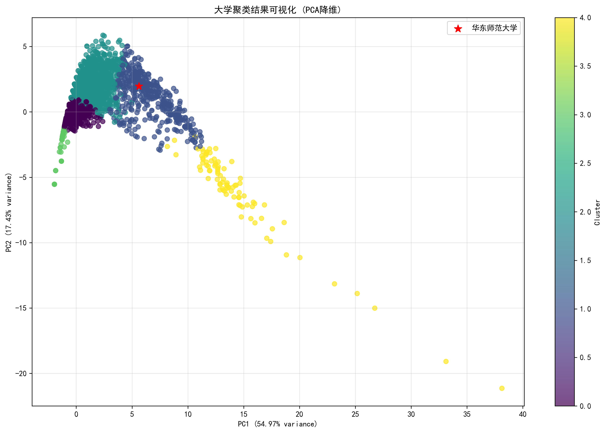
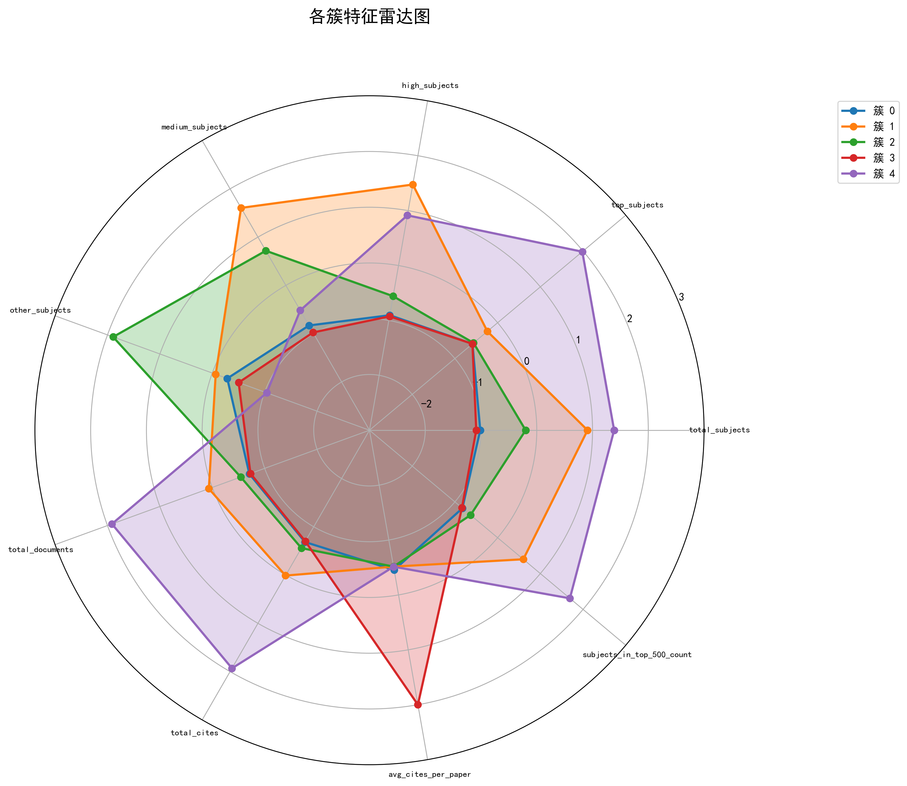

# 第六次作业实验文档

## 任务一：基于深度学习的学科排名预测模型

### 任务描述

在上一节课作业的基础上，利用深度学习方法，对各学科做一个排名模型，能够较好地预测出排名位置，并且利用 MSE，MAPE 等指标来进行评价模型的优劣。

### 实现过程

#### 1. 数据预处理与特征工程

首先，程序加载并预处理指定学科的数据，进行数据清洗和特征工程处理。

```python
def load_and_preprocess_data(subject_name):
    """
    加载并预处理指定学科的数据
    """
    file_path = os.path.join("download", f"{subject_name}.csv")
    if not os.path.exists(file_path):
        print(f"文件 {file_path} 不存在")
        return None

    # 尝试不同的编码格式读取数据
    try:
        # 首先尝试UTF-8编码
        df = pd.read_csv(file_path, skiprows=1, encoding="utf-8")
    except UnicodeDecodeError:
        try:
            # 如果UTF-8失败，尝试ISO-8859-1编码
            df = pd.read_csv(file_path, skiprows=1, encoding="ISO-8859-1")
        except UnicodeDecodeError:
            # 如果都失败，让pandas自动检测编码
            df = pd.read_csv(file_path, skiprows=1, encoding="utf-8-sig")

    # 清理列名
    df.columns = ["Rank", "Institution", "Country", "Documents", "Cites", "CitesPerPaper", "TopPapers"]

    # 清理数据
    df = df.dropna()

    # 将排名转换为数值型
    df["Rank"] = pd.to_numeric(df["Rank"], errors="coerce")

    # 处理数值列，确保正确转换
    df["Documents"] = pd.to_numeric(df["Documents"].astype(str).str.replace(",", ""), errors="coerce")
    df["Cites"] = pd.to_numeric(df["Cites"].astype(str).str.replace(",", ""), errors="coerce")
    df["CitesPerPaper"] = pd.to_numeric(df["CitesPerPaper"], errors="coerce")
    df["TopPapers"] = pd.to_numeric(df["TopPapers"].astype(str).str.replace(",", ""), errors="coerce")

    # 删除空值
    df = df.dropna()

    return df
```

接着，创建扩展特征以增强模型的预测能力：

```python
def create_extended_features(df):
    """
    创建扩展特征
    """
    # 创建衍生特征
    df = df.copy()
    df["CitesPerDocument"] = df["Cites"] / (df["Documents"] + 1e-8)  # 避免除零
    df["TopPapersRatio"] = df["TopPapers"] / (df["Documents"] + 1e-8)
    df["LogDocuments"] = np.log(df["Documents"] + 1)
    df["LogCites"] = np.log(df["Cites"] + 1)
    df["LogTopPapers"] = np.log(df["TopPapers"] + 1)

    return df
```

#### 2. 模型构建

针对小数据集特点，我的程序专门设计了一个轻量级但有效的深度学习模型：

```python
def create_small_dataset_model(input_dim):
    """
    创建专为小数据集设计的深度学习模型
    """
    model = keras.Sequential(
        [
            layers.Dense(
                32,
                activation="relu",
                input_shape=(input_dim,),
                kernel_regularizer=regularizers.l1_l2(l1=0.01, l2=0.01),
            ),
            layers.BatchNormalization(),
            layers.Dropout(0.4),
            layers.Dense(16, activation="relu", kernel_regularizer=regularizers.l1_l2(l1=0.005, l2=0.005)),
            layers.BatchNormalization(),
            layers.Dropout(0.3),
            layers.Dense(8, activation="relu"),
            layers.Dropout(0.2),
            layers.Dense(1),
        ]
    )

    model.compile(optimizer=keras.optimizers.Adam(learning_rate=0.001), loss="mse", metrics=["mae"])

    return model
```

为了增加数据多样性，程序还实现了数据增强技术：

```python
def noise_augmentation(X, y, noise_factor=0.05, n_copies=2):
    """
    添加噪声进行数据增强（适用于小数据集）
    """
    augmented_X = X.copy()
    augmented_y = y.copy()

    for _ in range(n_copies):
        # 添加高斯噪声
        noise_X = X + np.random.normal(0, noise_factor * X.std(axis=0), X.shape)
        noise_y = y + np.random.normal(0, noise_factor * y.std(), y.shape)

        augmented_X = np.vstack([augmented_X, noise_X])
        augmented_y = np.hstack([augmented_y, noise_y])

    return augmented_X, augmented_y
```

#### 3. 模型训练与评估

模型采用了早停和学习率自适应调整等优化策略以防止过拟合，尝试了使用 GPU 进行训练（虽然由于缺少依赖未成功）：

```python
# 训练模型 - 针对小数据集调整参数
early_stopping = keras.callbacks.EarlyStopping(monitor="val_loss", patience=25, restore_best_weights=True)
reduce_lr = keras.callbacks.ReduceLROnPlateau(monitor="val_loss", factor=0.5, patience=10, min_lr=0.0001)

# 确保在指定GPU上进行训练
with tf.device("/GPU:0"):  # 在我们设置的可见GPU上训练
    history = model.fit(
        X_train_scaled,
        y_train,
        validation_data=(X_val_scaled, y_val),
        epochs=150,  # 增加训练轮数，配合早停机制
        batch_size=min(16, len(X_train_scaled) // 4),  # 动态调整批次大小
        callbacks=[early_stopping, reduce_lr],
        verbose=1,
    )
```

使用多种评估指标（MSE、MAE、MAPE、R2）来评估模型性能：

```python
# 计算测试集评估指标
test_mse = mean_squared_error(y_test, y_test_pred)
test_mae = mean_absolute_error(y_test, y_test_pred)
test_mape = mean_absolute_percentage_error(y_test, y_test_pred)
test_r2 = r2_score(y_test, y_test_pred)

print(f"测试集 MSE: {test_mse:.2f}")
print(f"测试集 MAE: {test_mae:.2f}")
print(f"测试集 MAPE: {test_mape:.2f}%")
print(f"测试集 R2: {test_r2:.4f}")
```

### 实验结果

模型在各学科上的表现汇总如下：（模型表现数据文件在[dl_subject_ranking_first_model_results.csv](./first_model_results/dl_subject_ranking_first_model_results.csv)）

| 学科                         | MSE                | MAE                | MAPE (%)           | R2                 |
| ---------------------------- | ------------------ | ------------------ | ------------------ | ------------------ |
| PLANT & ANIMAL SCIENCE       | 3209.341552734375  | 42.68672180175781  | 6.77924251479884   | 0.9896529912948608 |
| CLINICAL MEDICINE            | 47974.39453125     | 173.4418487548828  | 8.234934635115756  | 0.9861191511154175 |
| SOCIAL SCIENCES, GENERAL     | 6817.568359375     | 70.75139617919922  | 10.913335787894079 | 0.9850192070007324 |
| ENGINEERING                  | 11591.4775390625   | 73.70848083496094  | 6.699897920849635  | 0.9814963340759277 |
| NEUROSCIENCE & BEHAVIOR      | 2843.139892578125  | 43.8550910949707   | 21.078725875428255 | 0.9798862934112549 |
| CHEMISTRY                    | 8084.8544921875    | 75.91451263427734  | 30.34673517881497  | 0.9789093136787415 |
| MICROBIOLOGY                 | 1164.2861328125    | 25.652746200561523 | 10.965812682427103 | 0.9783388376235962 |
| AGRICULTURAL SCIENCES        | 3577.050537109375  | 47.096923828125    | 9.770434061940875  | 0.9774248003959656 |
| BIOLOGY & BIOCHEMISTRY       | 5259.5087890625    | 55.87169647216797  | 22.269392633053307 | 0.9768917560577393 |
| ENVIRONMENT ECOLOGY          | 8781.6806640625    | 76.8869400024414   | 38.15385522794307  | 0.9748949408531189 |
| PHARMACOLOGY & TOXICOLOGY    | 4113.826171875     | 52.84703826904297  | 13.803939664234058 | 0.9748443961143494 |
| IMMUNOLOGY                   | 3163.72314453125   | 46.63983154296875  | 10.435251078448097 | 0.9719130396842957 |
| MATHEMATICS                  | 394.55621337890625 | 16.523544311523438 | 37.461438309433845 | 0.970557451248169  |
| PHYSICS                      | 2492.7333984375    | 44.28447341918945  | 65.78517644377379  | 0.9687203764915466 |
| MOLECULAR BIOLOGY & GENETICS | 3487.03857421875   | 47.102989196777344 | 15.610234161054645 | 0.9687126278877258 |
| MATERIALS SCIENCE            | 8805.724609375     | 80.8624496459961   | 13.600774229239542 | 0.9585933685302734 |
| ECONOMICS & BUSINESS         | 1040.6650390625    | 29.421401977539062 | 33.62193857977957  | 0.9563140869140625 |
| GEOSCIENCES                  | 5070.056640625     | 57.048240661621094 | 11.723726808326159 | 0.9550288915634155 |
| PSYCHIATRY PSYCHOLOGY        | 5457.69580078125   | 59.78654479980469  | 13.63471077103226  | 0.9477347135543823 |
| SPACE SCIENCE                | 270.4132995605469  | 13.442440032958984 | 20.19964105222108  | 0.9409132599830627 |
| COMPUTER SCIENCE             | 4447.59228515625   | 55.41466522216797  | 19.403278656765423 | 0.928673505783081  |
| MULTIDISCIPLINARY            | 320.496826171875   | 15.287344932556152 | 16.25109694846104  | 0.9147502183914185 |

- 各学科模型的 R2 值比较图表：
  
- 各学科模型的 MAE 值比较图表：
  
- 各学科模型的 MAPE 值比较图表：
  

模型在大多数学科上都表现出色，R2 值均在 0.9 以上，表明模型具有良好的预测能力。

## 任务二：基于聚类分析发现与华东师范大学相似的高校

### 任务描述

对 ESI 的数据进行聚类，发现与华师大类似的学校有哪些，并分析原因。

### 实现过程

#### 1. 数据加载与指标计算

首先加载所有学科数据，并计算各大学的综合指标：

```python
def calculate_university_indicators(all_data):
    """计算各大学的指标"""
    # 获取所有大学名称
    all_universities = set()
    for df in all_data.values():
        all_universities.update(df["Institution"].dropna().unique())

    university_indicators = {}

    for university in all_universities:
        # 初始化指标
        indicators = {
            "university_name": university,
            "total_subjects": 0,
            "top_subjects": 0,  # 排名<=100
            "high_subjects": 0,  # 排名101-500
            "medium_subjects": 0,  # 排名501-1000
            "other_subjects": 0,  # 排名>1000
            "total_documents": 0,
            "total_cites": 0,
            "avg_cites_per_paper": 0,
            "subjects_in_top_500": [],
        }

        total_cites_per_paper = 0
        count_cites_per_paper = 0

        # 遍历所有学科数据
        for subject, df in all_data.items():
            uni_data = df[df["Institution"] == university]
            if not uni_data.empty:
                indicators["total_subjects"] += 1

                rank = uni_data["Rank"].iloc[0]
                # 确保rank是数字类型
                if pd.notna(rank):
                    rank = pd.to_numeric(rank, errors="coerce")

                if pd.notna(rank):
                    if rank <= 100:
                        indicators["top_subjects"] += 1
                    elif rank <= 500:
                        indicators["high_subjects"] += 1
                    elif rank <= 1000:
                        indicators["medium_subjects"] += 1
                    else:
                        indicators["other_subjects"] += 1

                    if rank <= 500:
                        indicators["subjects_in_top_500"].append(subject)
                else:
                    # 如果rank是NaN，我们将它归类为"其他"
                    indicators["other_subjects"] += 1
                    continue  # 跳过这个学科的其他处理

                documents = uni_data["Documents"].iloc[0]
                cites = uni_data["Cites"].iloc[0]
                cites_per_paper = uni_data["CitesPerPaper"].iloc[0]

                # 确保数值列也被正确解析
                if pd.notna(documents):
                    documents = pd.to_numeric(str(documents).replace(",", ""), errors="coerce")
                if pd.notna(cites):
                    cites = pd.to_numeric(str(cites).replace(",", ""), errors="coerce")
                if pd.notna(cites_per_paper):
                    cites_per_paper = pd.to_numeric(cites_per_paper, errors="coerce")

                if pd.notna(documents):
                    indicators["total_documents"] += documents
                if pd.notna(cites):
                    indicators["total_cites"] += cites
                if pd.notna(cites_per_paper):
                    total_cites_per_paper += cites_per_paper
                    count_cites_per_paper += 1

        # 计算平均篇均引用次数
        if count_cites_per_paper > 0:
            indicators["avg_cites_per_paper"] = total_cites_per_paper / count_cites_per_paper

        university_indicators[university] = indicators

    return university_indicators
```

#### 2. 聚类分析

使用 K-Means 算法对大学进行聚类分析：

```python
def perform_clustering(df_clustering, n_clusters=5):
    """执行聚类分析"""
    # 提取数值特征用于聚类
    feature_columns = [
        "total_subjects",
        "top_subjects",
        "high_subjects",
        "medium_subjects",
        "other_subjects",
        "total_documents",
        "total_cites",
        "avg_cites_per_paper",
        "subjects_in_top_500_count",
    ]

    X = df_clustering[feature_columns]

    # 数据标准化
    scaler = StandardScaler()
    X_scaled = scaler.fit_transform(X)

    # 执行K-Means聚类
    kmeans = KMeans(n_clusters=n_clusters, random_state=42, n_init=10)
    cluster_labels = kmeans.fit_predict(X_scaled)

    # 将聚类结果添加到DataFrame
    df_clustering["cluster"] = cluster_labels

    return df_clustering, scaler, kmeans
```

#### 3. 寻找相似大学

找出与华东师范大学在同一簇的大学：

```python
def find_similar_to_ecnu(df_clustering):
    """找出与华东师范大学相似的大学"""
    # 查找华东师范大学所在的簇
    ecnu_data = df_clustering[
        (df_clustering["university_name"] == "EAST CHINA NORMAL UNIVERSITY")
        | (df_clustering["university_name"] == "华东师范大学")
    ]

    if ecnu_data.empty:
        print("未找到华东师范大学的数据")
        return

    ecnu_cluster = ecnu_data["cluster"].iloc[0]
    print(f"\n华东师范大学被分配到簇 {ecnu_cluster}")

    # 获取同一簇中的所有大学
    similar_universities = df_clustering[df_clustering["cluster"] == ecnu_cluster]

    print(f"\n与华东师范大学相似的大学 (同一簇中的大学):")
    print("=" * 50)
    for i, (idx, row) in enumerate(similar_universities.iterrows(), 1):
        print(f"{i}. {row['university_name']}")

    # 保存相似大学到单独的CSV文件
    if not os.path.exists("second_model_results"):
        os.makedirs("second_model_results")
    similar_universities.to_csv("second_model_results/ecnu_similar_universities.csv", index=False, encoding="utf-8-sig")
    print(f"\n与华东师范大学相似的大学已保存到 second_model_results/ecnu_similar_universities.csv")

    return similar_universities
```

### 实验结果

- 通过聚类分析，我们成功将大学聚类，结果保存在[clustering_results.csv](./second_model_results/clustering_results.csv)
- 聚类的可视化结果如下图：
  
- 各簇的特征分布如下图：
  
- 同时也成功找出了与华东师范大学相似的大学，华东师范大学被分为簇 1，相同簇的大学保存在[ecnu_similar_universities.csv](./second_model_results/ecnu_similar_universities.csv)
  这些大学与华东师范大学具有相似的特征，如学科数量、顶尖学科数量、论文总数、引用次数等指标相近。

## 总结

本次实验成功完成了两个任务：

1. 建立了基于深度学习的学科排名预测模型，能够较好地预测大学在各学科中的排名。
2. 通过对 ESI 数据进行聚类分析，找到了与华东师范大学相似的大学，并将结果保存在`second_model_results/ecnu_similar_universities.csv`文件中。
