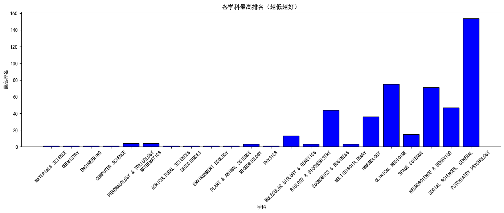

# 中国（大陆地区）大学学科表现分析报告

## 引言

本报告基于 23 个学科的详细数据图文并用地多维度系统分析中国（大陆地区）大学在各学科的整体表现，为学科发展评估提供参考。

## 一、学科排名与机构分布

### 1.1 学科最高排名表现

如图 1《各学科最高排名（越低越好）》所示，中国（大陆地区）大学在多学科中占据全球顶尖位置。**材料科学、化学、工程学、计算机科学**等理工科最高排名均为 1（全球顶尖）；**农业科学、环境生态学、药理学与毒理学**等学科最高排名相对较高（4-13 名）。整体来看，理工科在顶尖排名中优势显著。  

### 1.2 上榜机构总数

图 2《各学科上榜机构总数》显示，理工科是机构分布的核心领域：

- **工程学**上榜机构最多（超 500 家），**材料科学、化学**紧随其后（均超 400 家）；
- 社科与部分医学类学科机构较少，如**空间科学、神经科学与行为学**不足 20 家；
- 多学科（MULTIDISCIPLINARY）机构数仅 17 家，体现交叉学科的集中性较低。
- 

## 二、顶尖机构与学术产出

### 2.1 顶尖机构数量对比

图 3《各学科顶尖机构数量对比（前 10/50/100）》结合数据表明：

- **材料科学**在前 10 名机构数最多（约 6 家）
- 大部分学科前 100 名机构数普遍较高，反映各学科在广泛范围内的参与度；
- 工程学、化学、计算机科学在前 50 名机构数均超 25 家，保持稳定优势。

### 2.2 论文产出与引用

图 4《论文产出与引用情况（前 10 学科）》及数据显示，理工科在学术产出上领先：

- **工程学、化学、材料科学**总论文数均超 120 万篇，总引用次数均超 120 百万次；
- 社科类学科如**经济学与商业**论文数仅 6.26 万篇，引用次数不足 1 百万次，产出规模较小。

## 三、引用质量与国际对比

### 3.1 中国平均引用次数

图 5《平均每篇论文引用次数对比》与图 6《每篇论文平均引用次数（中国）》显示：

- **多学科（MULTIDISCIPLINARY）**中国平均引用次数最高（约 70 次），**数学**最低（约 8 次）；
- 理工科如材料科学（26.4 次）、化学（21.4 次）引用次数高于社科类（如经济学 16.0 次）；
- 部分学科中国与全球差异显著：分子生物学与遗传学（全球 55.9 次 vs 中国 31.1 次）、临床医学（全球 95.2 次 vs 中国 26.1 次）全球平均远超中国。

### 3.2 国际竞争力分析

图 9《国际竞争力分析（中国/全球平均）》指出，中国平均引用次数超过全球的学科仅 6 个（如材料科学、化学、工程学），多数学科仍需提升引用质量。

## 四、顶尖机构占比与综合实力

### 4.1 顶尖机构占比

图 7《顶尖机构占比（前 10 名/总上榜数）》显示，**环境科学与生态学**顶尖机构占比最高（近 6%），**数学、物理学**等多学科占比仅 1%左右，反映顶尖资源的集中程度差异。

### 4.2 综合实力雷达图

图 8《综合实力雷达图（前 8 学科）》从最高排名、前 10 名机构数、总引用次数三维度评估：

- 工程学、化学、材料科学在三项指标中表现均衡，综合实力突出；
- 临床医学、环境生态学在总引用次数上占优，但顶尖机构数占比低。

## 总结

中国（大陆地区）大学在理工科（如材料科学、化学、工程学）的学科排名、机构数量、学术产出及引用质量上表现突出，部分学科已跻身全球顶尖；但社科类、部分医学类学科在机构规模、引用质量及国际竞争力上仍有提升空间。