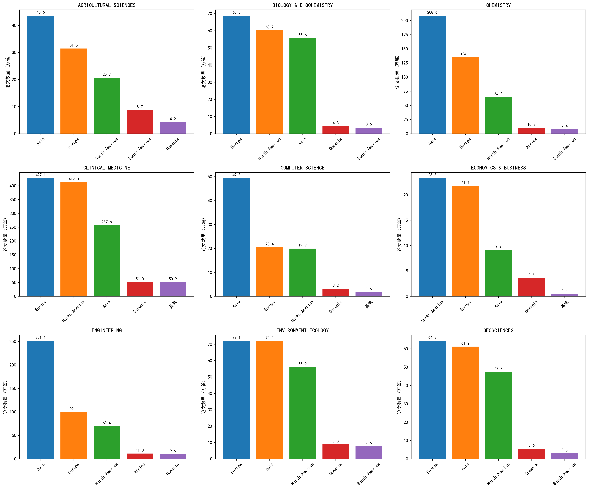
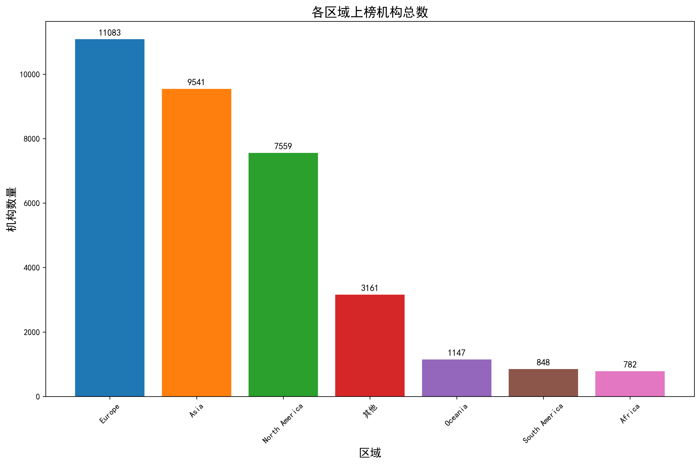
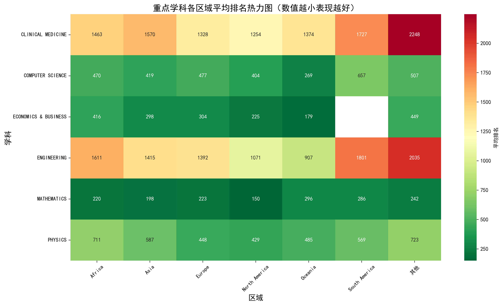
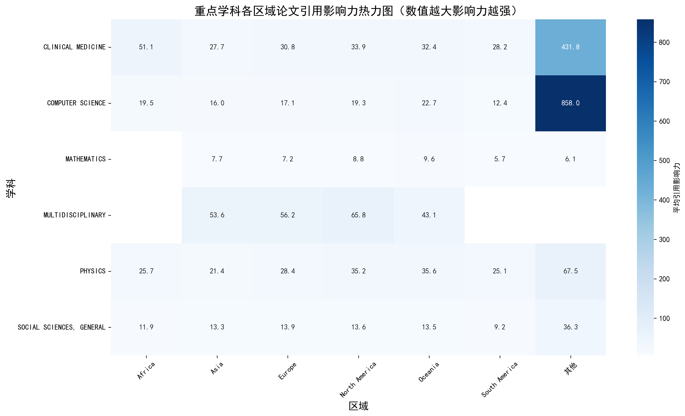
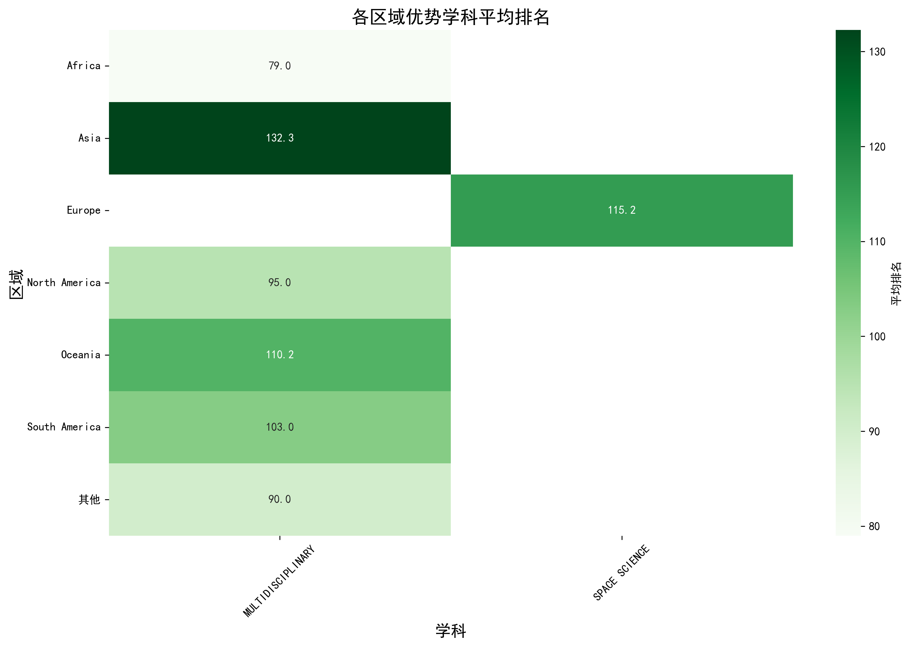

# 全球不同区域在各个学科中的表现分析报告

本报告基于提供的数据，分析全球不同区域在各个学科领域的表现情况，包括论文数量、机构数量、排名和引用影响力等维度。

## 1. 各区域论文总量分析

从论文总量来看，亚洲、欧洲和北美洲是科研产出最多的三个区域。其中：

- **化学领域**：亚洲以2,086,097篇论文领先，是唯一超过200万篇的区域
- **临床医学领域**：欧洲和北美洲分别以4,270,998篇和4,119,743篇论文居前两位
- **工程学领域**：亚洲以2,511,308篇论文遥遥领先，远超欧洲和北美洲

## 2. 各区域上榜机构数量分析

在各学科领域中，上榜机构数量反映了该区域在该学科的研究活跃度：

- **临床医学**：欧洲以1661个机构领先，其次是其他区域(2295个)和北美洲(1088个)
- **社会科学**：欧洲以821个机构领先，北美洲(701个)和亚洲(535个)紧随其后
- **农业科学**：欧洲(456个)、亚洲(484个)和北美洲(213个)是主要参与者

下图反映了各个地区所有学科的上榜机构数量：

## 3. 各区域平均排名分析

平均排名越低表示该区域在该学科中的表现越好：

- **计算机科学**：大洋洲以268.91的平均排名领先，亚洲(418.54)和北美洲(403.53)表现也相对较好
- **经济学与商业**：北美洲以224.69的平均排名领先，大洋洲(179.25)表现同样突出
- **空间科学**：北美洲(107.64)和欧洲(114.87)平均排名最低，表现最佳

## 4. 各区域论文引用影响力分析

论文引用影响力(citations_per_paper)反映了研究成果的质量和影响力：

- **多学科领域**：北美洲以65.81的引用影响力领先，欧洲(56.16)和亚洲(53.56)紧随其后
- **分子生物学与遗传学**：其他区域以71.82的引用影响力领先，远超其他区域
- **物理学**：其他区域以67.50的引用影响力领先，大洋洲(35.56)和北美洲(35.15)表现也较好

## 5. 各区域优势学科

根据平均排名数据，各区域的优势学科如下：

| 区域 | 优势学科 | 平均排名 |
|------|----------|----------|
| 非洲 | 多学科 | 79.0 |
| 其他 | 多学科 | 90.0 |
| 北美洲 | 多学科 | 95.0 |
| 南美洲 | 多学科 | 103.0 |
| 大洋洲 | 多学科 | 110.2 |
| 欧洲 | 空间科学 | 115.25 |
| 亚洲 | 多学科 | 132.28 |

## 6. 综合分析与结论

1. **亚洲**在论文总量方面表现突出，尤其在化学、材料科学和工程学等领域具有明显优势，但在平均排名和引用影响力方面有待提升。

2. **北美洲**在多个学科的平均排名和引用影响力方面表现优异，尤其在多学科、心理学和神经科学等领域表现突出。

3. **欧洲**在临床医学、社会科学和农业科学等领域具有较强的科研实力，上榜机构数量较多。

4. **大洋洲**虽然在论文总量方面不占优势，但在计算机科学和经济学与商业等领域的平均排名表现突出。

5. **非洲**在多学科领域具有相对优势，但整体科研产出和影响力仍有待提升。

6. **其他区域**在临床医学领域的引用影响力表现突出。

## 7. 建议

1. 各区域应继续发挥自身优势学科的特长，同时加强薄弱学科的建设。
2. 加强国际合作，特别是亚洲、非洲等区域可以与北美洲、欧洲在高质量研究方面加强合作。
3. 注重研究质量的提升，不仅关注论文数量，更要关注论文的影响力和实际贡献。
